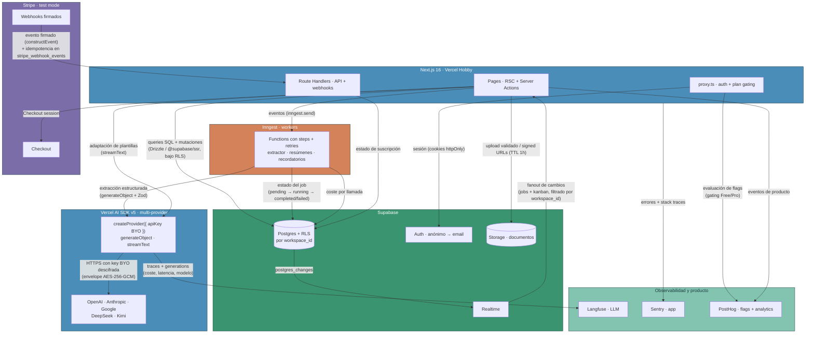

# Arquitectura de Tendr

Diagrama lógico del MVP según las decisiones de ADR-001 (stack por capa), ADR-002 (hosting) y ADR-003 (abstracción IA). Cada flecha indica qué viaja por ese canal.

**Colores semánticos**: azul (app + IA), verde (datos + observabilidad), naranja (workers), púrpura (pagos).

**Reglas que el diagrama codifica**:

- El trabajo IA largo (extractor) entra siempre por Inngest, nunca por Server Actions (timeout 10s de Hobby, ADR-001).
- Toda lectura/escritura de datos pasa bajo RLS por `workspace_id`; Realtime se suscribe filtrado por workspace (sin filtro = leak entre tenants).
- Las keys BYO solo existen en claro dentro del server al instanciar el provider (ADR-003); nunca en BD, logs ni cliente.
- Stripe entra por Route Handler con verificación de firma e idempotencia antes de tocar la BD.
- El gating Free/Pro se decide en `proxy.ts` apoyado en flags de PostHog.

Referencias: [ADR-001](decisions/ADR-001-architecture.md) · [ADR-002](decisions/ADR-002-vercel-tos.md) · [ADR-003](decisions/ADR-003-ai-abstraction-vercel-ai-sdk.md).
