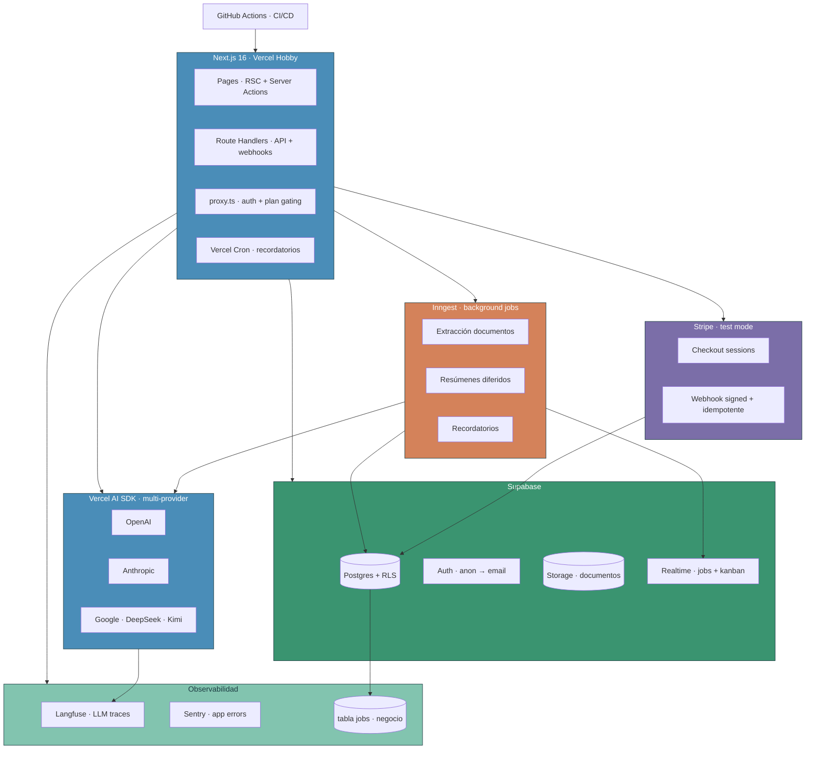
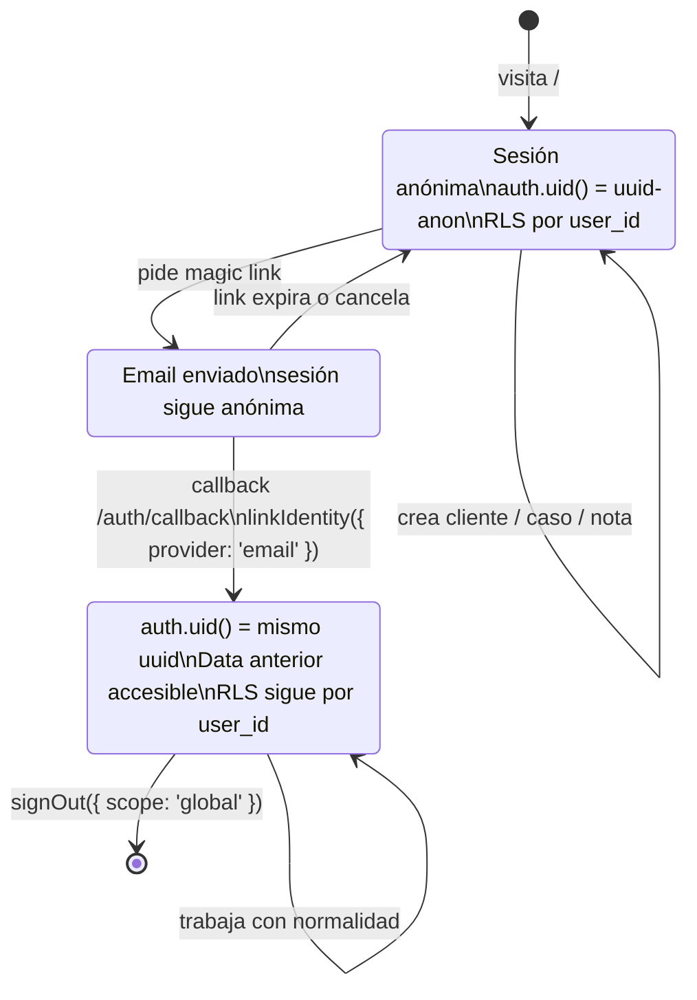
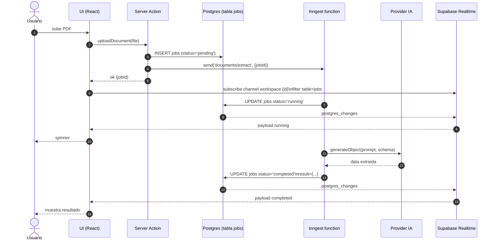
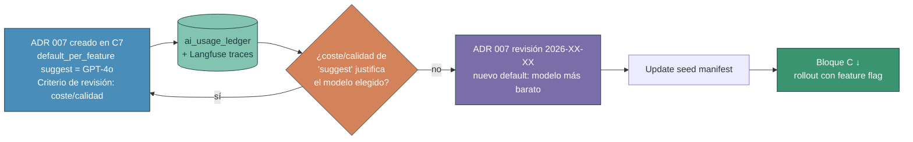
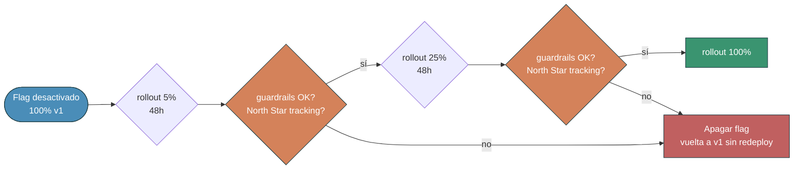

# L17 · Plan · Tendr · SaaS fullstack con stack profesional gratuito

> Documento de trabajo. Define **qué** se construye en L17 y **por qué**. Para el razonamiento crítico, ver `debate.md`. Para preguntas abiertas, ver `preguntas.md` y `../../_compartido/tecnico/preguntas-compartidas.md`. Para seguridad y prácticas de producción, ver `produccion-y-seguridad.md`.

**Producto del caso:** Tendr (la app que vende la landing de L16).
**Conexión con L16:** comparten identidad visual (`design.md`), pricing tiers y Skill de auditoría SEO. Ver `../../_compartido/tecnico/preguntas-compartidas.md`.

---

## 1. Qué es Tendr

Aplicación para gestionar clientes externos. Pensada para perfiles B2B junior que entran a la empresa a roles de customer success, account management, ventas junior, project management, consultoría, o que freelancean en paralelo.

### 1.1 Funcionalidades

| Bloque | Detalle |
|---|---|
| Clientes | CRUD con info, contactos, etiquetas, estado activo/archivado |
| Casos / oportunidades | Por cliente, con pipeline de estados (prospect → propuesta → en curso → cerrado) |
| Kanban global | Vista transversal de todos los casos por estado |
| Notas | Por cliente y por caso, markdown |
| Documentos | Por cliente, subidos a Supabase Storage |
| Plantillas de email | Con la marca propia, variables y preview |
| AI features | Adapta plantillas, resume relación, sugiere acción, extrae info de documentos |
| Pagos | Free vs Pro vs Team con Stripe en sandbox |

### 1.2 Audiencia objetivo

| Perfil del alumno | Por qué le aporta |
|---|---|
| Customer success / account manager junior | Reconoce el modelo Salesforce/HubSpot desde dentro |
| Ventas junior / BD | Practica el modelo de oportunidades + pipeline |
| Project manager junior | Aprende el patrón de casos + Kanban |
| Consultor junior | Plantillas de onboarding, propuestas, comunicación |
| Marketing ops | Sistema de plantillas con marca y variables |
| Freelance en paralelo | Lo usa de verdad como herramienta personal |

---

## 2. Decisiones clave del caso

| Decisión | Detalle | Razón |
|---|---|---|
| Producto concreto, no genérico | Tendr aterrizado a B2B junior | Motivación + modelo de datos rico |
| IA adapta, no genera | Plantillas con voz del usuario + contexto del cliente | Diferenciador pedagógico vs tutoriales superficiales |
| **Multi-provider con BYO key** | Vercel AI SDK abstrae providers (OpenAI, Anthropic, Gemini, DeepSeek, Kimi). Cada workspace mete su API key cifrada y elige modelo por feature | Patrón premium B2B (Cursor, Linear, Notion AI lo hacen). Best practice según Gartner. Enseña envelope encryption + abstracción real |
| Auth anónimo a autenticado | Soportado nativo Supabase, promoción preserva `auth.uid()` | Patrón premium (Linear, Notion, Figma); enseña producto |
| Jobs persistidos con realtime | Tabla `jobs` + Inngest + Supabase Realtime | Patrón del proyecto referencia traducido a stack gratuito |
| Observabilidad multicapa | Sentry (app) + Langfuse (LLM) + tabla `jobs` (negocio) | Las llamadas a IA son recursos contables |
| Vercel Hobby + disclaimer ToS | Asumido y explicado | Lección real sobre lectura de ToS (ver `../../_compartido/tecnico/preguntas-compartidas.md §3`) |
| Pagos en L17, no en L16 | Stripe Checkout en test mode + webhook signed | Encaja con auth + BD ya existentes |
| Stack 100% gratuito (excepto IA) | Vercel + Supabase + Inngest + Langfuse + Stripe test. **Coste IA: del usuario, con su key** | Replicable por el alumno sin barreras + BYO key transfiere coste correctamente |

---

## 3. Stack final verificado (mayo 2026)

| Capa | Herramienta | Free tier | Caveat |
|---|---|---|---|
| Hosting | Vercel Hobby | 100GB transfer, 1M function invocations, 1M edge requests, 1GB Blob | Prohíbe uso comercial. Ver `debate.md §3`. |
| BD + Auth + Storage + Realtime | Supabase | 500MB Postgres, 1GB Storage, 50k MAU, 5GB egress | Pausa tras 1 semana de inactividad. Despausa en 1 click. |
| Background jobs | Inngest | 50k runs/mes | Suficiente para SaaS de aprendizaje |
| Email transaccional (opcional) | Resend | 3.000/mes, 100/día | Requiere DNS para dominio |
| Pagos sandbox | Stripe test mode | Indefinido, sin verificación | Test cards (`4242 4242 4242 4242`) |
| LLM observability | Langfuse Cloud | 50k observations/mes, 30 días retención | Adquirida por ClickHouse en enero 2026, MIT confirmada |
| App errors | Sentry | 5k errores/mes | Sufficient |
| CI/CD | GitHub Actions | 2.000 min/mes private | Sobra |
| **AI abstraction layer** | **Vercel AI SDK** | Open source, gratuita | Unifica OpenAI, Anthropic, Google, DeepSeek, Kimi, Groq. Streaming, tool calling, `generateObject` con Zod, file input |
| IA providers soportados | OpenAI, Anthropic, Google Gemini, DeepSeek, Kimi (Moonshot) | Pago por el usuario con su key | Único coste real, **traspasado al usuario** vía BYO key |

---

## 4. Arquitectura

### 4.1 Diagrama lógico



**Colores semánticos del diagrama**: azul (razonamiento y contexto: app + IA), verde (datos: Supabase + observabilidad), naranja (acción: workers), púrpura (taxonomía: pagos).

### 4.2 Principios del proyecto referencia (`ai-learning-engine`) traducidos

El proyecto referencia es **producción seria sobre GCP**. L17 mantiene los principios arquitectónicos en versión gratuita:

| Principio del referente | Traducción a L17 |
|---|---|
| Separación de responsabilidades (Studio + API + Generator) | Next.js (UI + API) + Inngest functions (workers IA) |
| Jobs persistidos en DB (`generation_jobs`) | Tabla `jobs` en Supabase con `status`, `progress`, `error` |
| Pub/sub para realtime UI (Redis SSE fanout) | Supabase Realtime (suscripción a `jobs` filtrada por workspace) |
| Storage con signed URLs | Supabase Storage signed URLs (1h TTL) |
| Schema-first con migraciones (Drizzle) | Drizzle ORM + drizzle-kit, migraciones en CI |
| Secretos fuera de Git | `.env.local` + Vercel env vars |
| Permisos mínimos por componente | RLS estricto en Supabase |
| CI/CD declarativo | GitHub Actions + Vercel/Supabase deploy |
| Observabilidad por DB (`generation_jobs`) | Tabla `jobs` + Langfuse + Sentry |

Lo que se deja fuera por sobre-ingeniería para el caso (mencionado como roadmap):

- Containers + Cloud Run + VPC privado.
- Terraform multi-root.
- Memorystore Redis dedicado.
- Workload Identity Federation.

---

## 5. Auth replanteada · patrón anónimo a autenticado

### 5.1 Por qué se replantea

"Login, signup y sesiones en App Router" plano es un tutorial de la doc de Supabase. El agente lo genera en 10 minutos, el alumno copia formularios, no hay criterio.

### 5.2 Flujo adoptado

1. Usuario abre Tendr y puede crear 1 cliente con 1 caso **sin registrarse**. Supabase crea sesión anónima con `auth.uid()` válido.
2. Actividad anónima persiste con `user_id = uid anónimo`. RLS aplica igual.
3. Cuando el usuario quiere persistir entre dispositivos, se le pide email (magic link, sin password).
4. Al confirmar, Supabase **promociona** la sesión: `auth.uid()` pasa de anónimo a autenticado, **manteniendo el UID**. Data migra automáticamente.



**Lo que vacuna este patrón**: el `auth.uid()` se preserva al promocionar; la data anónima sigue siendo accesible sin migración manual porque las policies de RLS son las mismas en los dos estados.

### 5.3 Beneficios

- Patrón premium usado por Linear, Notion, Figma.
- Reduce fricción de UX a casi cero.
- RLS funciona idéntico para anónimos y autenticados.
- Enseña la auth como decisión de producto, no como checkbox.

---

## 6. Features IA · cuatro que no son gimmicks

Todas siguen la regla **adapta con contexto, no genera en vacío**:

| Feature | Qué hace | Tipo | Capabilities mínimas |
|---|---|---|---|
| Adaptador de plantillas | "Adapta esta plantilla de onboarding para este cliente (agencia, presupuesto medio, tono cercano)" | Síncrono (Server Action) con streaming | Texto, 16k+ ctx |
| Resumen de relación | "Cuéntame en qué estamos con este cliente". Lee notas, casos, último contacto. Brief de 5 líneas. | Síncrono (Server Action) con streaming | Texto, 32k+ ctx (notas extensas) |
| Sugerencia de siguiente acción | Lee estado y propone next step (mandar plantilla X, llamar, esperar Y días) | Síncrono (Server Action) | Texto, 16k+ ctx |
| Extractor de documentos | Al subir contrato, extrae fechas clave, importes, partes. Crea recordatorios. | Asíncrono (Inngest job) con `generateObject` + Zod | **PDF nativo o multimodal**, 64k+ ctx, structured output |

**Criterio de síncrono vs job:**

- Tarda < 5s y el usuario espera el resultado → Server Action síncrono (con streaming).
- Tarda > 5s o no necesita respuesta inmediata → Inngest job persistido con Realtime fanout.

**Validación de capabilities por feature:**

Cada feature declara las capabilities mínimas que necesita. El **manifest interno de modelos** (ver fase 3 y fase 7) las verifica. Si el usuario del workspace eligió un modelo sin las capabilities requeridas para una feature concreta, esa feature queda **disabled en la UI** y se le sugiere upgrade. Ejemplo: si el usuario eligió DeepSeek (no soporta PDF nativo) para "Extractor de documentos", la app extrae texto del PDF antes de mandar al modelo, o le sugiere cambiar a Gemini/GPT para esa feature.

---

## 7. Observabilidad multicapa · la pieza distintiva

Tres capas que se montan a lo largo del caso. Detalle técnico en `produccion-y-seguridad.md §7`.

### 7.1 Capa 1 · App errors (Sentry)

Errores client + server, source maps en deploy, releases versionados. ~15 min de setup en fase 9.

### 7.2 Capa 2 · LLM traces (Langfuse)

Cada llamada a Anthropic se envuelve:

- Input prompt completo.
- Output (response).
- Tokens in/out.
- Latencia.
- Coste calculado por modelo.
- Metadata: `user_id`, `workspace_id`, `template_id` cuando aplique.

El alumno **ve en directo cuánto le cuesta cada interacción de IA**. Las llamadas al modelo son recursos contables, no magia.

### 7.3 Capa 3 · Jobs persistidos con realtime (patrón del referente)

Tabla `jobs` (ver schema en `produccion-y-seguridad.md §3`).

Flujo:

1. Usuario sube documento → Server Action crea row en `jobs` con status `pending` y dispara Inngest.
2. Inngest function levanta el job, marca `running`, ejecuta extracción, emite `progress` parcial, marca `completed` con resultado.
3. Supabase Realtime hace fanout de cambios filtrado por `workspace_id`.
4. UI suscrita muestra spinner → progreso → resultado.



Es exactamente el patrón de `generation_jobs` + Redis pub/sub del referente, traducido a stack gratuito. **El filtro `workspace_id` en la suscripción Realtime es obligatorio**: sin él hay leak entre tenants.

---

## 8. CI/CD agéntico

El pipeline integra al agente como actor del flujo, no como asistente externo.

```yaml
# Conceptual
on: pull_request
jobs:
  validate:
    - lint (Biome)
    - typecheck (tsc --noEmit)
    - test (Vitest)
    - drizzle-kit check (detecta drift de schema)
    - build (next build)
  preview:
    - deploy preview a Vercel
    - comentar URL en el PR
  ai-review:
    - claude-code-action revisa cambios y comenta findings

on: push to main
jobs:
  migrate:
    - drizzle-kit migrate contra Supabase prod
  deploy:
    - deploy a Vercel production
  smoke:
    - verificar /api/health
    - smoke test con Playwright CLI
```

Flujo del alumno:

1. Pide al agente implementar una feature.
2. Agente trabaja, commitea, abre PR con `gh`.
3. CI corre validaciones automáticas.
4. Preview deploy genera URL de prueba.
5. Claude Code Action revisa el PR.
6. Si CI falla, alumno copia el log al agente y debuggean juntos. Se enseña explícitamente esta interacción.
7. Merge → migraciones + deploy + smoke check.

---

## 9. Pagos con Stripe sandbox

Detalle técnico (webhook signature verification, idempotencia) en `produccion-y-seguridad.md §5`.

- Cuenta de Stripe en **test mode** (gratis, instantánea, sin verificación de empresa).
- Plan Free: CRM completo (clientes, casos, Kanban, plantillas) sin IA.
- Plan Pro: CRM completo + features IA con BYO key (€9/mes).
- Plan Team: roadmap post-MVP, visible en landing como "próximamente".
- Stripe Checkout (hosted, simple).
- Webhook signed con `stripe.webhooks.constructEvent`.
- Tabla `subscriptions` actualizada por el webhook.
- Middleware Next.js gatekeepa features pro consultando la suscripción.

---

## 10. Desglose de 10 fases

Caso práctico único en archivo `clase-1-caso-practico.md`.

| # | Tipo | Fase | Foco |
|---|---|---|---|
| 1 | Conceptual | **JTBD + spec del producto y mentalidad MVP** | Bloque previo de JTBD (5 bloques: antes/dolor/contrato/éxito/riesgo). Alcance, qué entra, qué no, roadmap. SDD en directo. |
| 2 | Decisión | Arquitectura y stack | Vercel + Supabase + Inngest + Langfuse + Stripe. Tradeoffs. **Lectura de ToS de Vercel como momento pedagógico.** |
| 3 | Tutorial | Scaffolding + modelo de datos + RLS + migraciones | Drizzle, tablas, policies por workspace, tests de RLS |
| 4 | Decisión + Tutorial | Auth con patrón anónimo a autenticado | Estrategia, sesiones, magic link, migración automática |
| 5 | Tutorial | Workspace core: clientes, casos y Kanban + **bloque code review** | CRUD con Server Actions + DnD Kit + Supabase Realtime. **Bloque pedagógico explícito de code review y tamaño de PR** ("small CL" de Google) en el primer PR no trivial del agente. **Cierra con validación visual de la fase.** |
| 6 | Tutorial | Documentos con Storage + AI extractor (job persistido) | Upload, signed URLs, Inngest, Realtime notifica UI. **Cierra con validación visual de la fase.** |
| 7 | Tutorial | Plantillas con AI + multi-provider BYO key + observabilidad LLM | Vercel AI SDK + streaming + structured output + UI de settings AI con envelope encryption AES-256-GCM + manifest de modelos + capability validation + per-feature model picker + cost budget + Langfuse. **Cierra con validación visual de la fase.** |
| 8 | Tutorial | Pagos con Stripe sandbox | Checkout + webhook signed + tabla `subscriptions` + middleware. **Cierra con validación visual de la fase.** |
| 9 | Tutorial | **Validación end-to-end y QA visual** | E2E con Playwright de flujos críticos + a11y por pantalla + responsive + cross-browser + visual review contra `design.md`. **Gate antes de deploy.** |
| 10 | Tutorial | CI/CD agéntico + observabilidad completa + deploy + **loop observabilidad→ADR + feature flag + vocabulario DORA/SLO** | GitHub Actions + AI review + Sentry + smoke check. **Bloque B**: ADR `007-default-model-assignment` se reabre con datos de Langfuse. **Bloque C**: rollout del nuevo default con feature flag (Statsig/GrowthBook/PostHog), North Star + guardrails explícitos. **Bloque D**: mención de DORA + SLO/SLI/error budget como vocabulario profesional. |

---

## 11. Detalle por fase

Cada fase explicada con el mismo esquema: qué es y qué produce, por qué existe, qué aprende el alumno, conexión con fases vecinas, cómo se ve en práctica, y pitfalls a evitar.

---

### 11.1 Fase 1 · JTBD + spec del producto y mentalidad MVP

**Tipo:** Conceptual · **Artefacto:** `jtbd.md` + `spec.md` versionado + lista priorizada de tareas.

#### Bloque previo · JTBD (10–15 min)

Antes de escribir el spec, el alumno articula **para qué se contrata** Tendr usando la plantilla JTBD canónica (ver `../../_compartido/metodologia/flujo-de-trabajo.md §6.1`). Cinco bloques cortos: **Antes / Dolor / Contrato / Éxito / Riesgo de no usar**.

Aplicado a Tendr, el alumno produce algo como:

```markdown
## JTBD · Tendr

### Antes
Account manager junior usa Excel + post-its + recordatorios de Outlook.

### Dolor
Al pasar de 5-6 clientes activos, pierde casos por olvido, no ve qué
propuesta cerrar primero, mezcla notas entre clientes.

### Contrato
"Cuando tengo más de 5 clientes activos, quiero ver de un vistazo
dónde está cada propuesta, para no perder ninguna por olvido."

### Éxito
Cero casos olvidados >30 días en estado `proposal`. Tiempo medio
entre "marca caso como activo" y "lo mueve a cerrado" disminuye
respecto a Excel.

### Riesgo de no usar
Vuelve a Excel y borra la cuenta.
```

**Por qué este bloque existe.** Sin JTBD el alumno construye lo que se le pide, no lo que el usuario necesita. JTBD es lenguaje de PM senior (Christensen, Moesta, Torres) que el alumno B2B junior verá en empresa. El spec que sigue parte del **problema validado**, no del producto presupuesto.

**Cómo se ve en práctica.**

1. El alumno abre `jtbd.md` con la plantilla vacía.
2. Pide al agente: "ayúdame a rellenar la sección 'Antes' partiendo del perfil 'account manager junior en consultoría B2B'". El agente sugiere; el alumno decide y edita.
3. Repite por bloque. Al cerrar, el alumno tiene una hipótesis articulada de **para qué contrata el usuario** el producto.
4. El JTBD se commitea al repo. Se referencia desde `AGENTS.md` (`@jtbd.md`) junto con `spec.md` y `design.md`.

**Pitfalls del bloque JTBD.**

- Mezclar problema con solución ("el problema es que falta una app de CRM"). El problema es la fricción, no la app.
- Bloque "Éxito" no observable ("el usuario está contento"). Si no es medible, no es criterio.
- Saltar el bloque "Riesgo de no usar". Sin él, el equipo no sabe a qué se enfrenta si la solución no funciona.

#### Bloque principal · spec MVP + tasks

**Qué es y qué produce.** SDD en directo aplicado a producto. Con el JTBD encima de la mesa, el alumno escribe la spec **antes de tocar código**. Define: qué hace el producto, qué no hace, criterios de éxito, alcance MVP vs roadmap, restricciones (free tier, ToS de Vercel), riesgos, **modelo de costes de IA (BYO key vs incluido)**. Produce `spec.md` versionado y `tasks.md` con priorización.

**Decisión de producto clave que se toma aquí:** Tendr funciona con **multi-provider BYO key**. Cada workspace mete su API key de OpenAI, Anthropic, Gemini, DeepSeek o Kimi, y elige qué modelo usa cada feature. Esto se decide en la fase 1 porque condiciona el modelo de datos (fase 3) y toda la arquitectura IA (fase 7). Razones:

- Patrón premium B2B que el alumno verá en Cursor, Linear, Notion AI, etc.
- Transfiere el coste de IA al usuario (el producto no factura tokens).
- Enseña abstracción real sobre providers + envelope encryption (best practice según Gartner).
- Da control de privacidad al usuario (su key, su data, no pasamos por terceros).

**Por qué existe esta fase.** Es la primera porque las decisiones de producto preceden a las técnicas. Sin spec, el alumno construye sin foco. Esta fase enseña explícitamente la **mentalidad MVP**: recortar es ingeniería, no debilidad. SDD se introduce formalmente en L8 (M2); aquí se aplica en directo a un producto real para que el alumno lo viva antes de teorizarlo.

**Qué aprende el alumno.**

- Cómo escribir un spec defendible (alcance, criterios, restricciones).
- Cómo recortar (qué entra vs qué queda roadmap).
- Cómo priorizar tareas con criterio (impacto vs esfuerzo).
- Cómo comunicar el alcance a stakeholders hipotéticos.

**Conexión con fases vecinas.** Alimenta todas las fases siguientes. El spec es el contrato que el alumno revisa periódicamente para no derivar.

**Cómo se ve en práctica.**

1. `sdd-explore` con prompt "construir mini-CRM para gestionar clientes externos B2B".
2. `sdd-propose` genera 2-3 propuestas, el alumno elige una.
3. `sdd-spec` formaliza el alcance con criterios de éxito medibles.
4. `sdd-tasks` parte en tareas priorizadas.
5. Revisión del alumno: ¿está claro qué entra y qué no? ¿Hay criterio de éxito medible? ¿Las dependencias entre tareas son razonables?

**Pitfalls a evitar.**

- Spec ambicioso (todo el roadmap dentro del MVP).
- Spec vago ("la app gestiona clientes" sin criterios accionables).
- No priorizar (todas las tareas tienen el mismo peso).
- No documentar lo que NO entra (el lector asume que sí).

---

### 11.2 Fase 2 · Arquitectura y stack

**Tipo:** Decisión · **Artefacto:** ADRs de arquitectura + diagrama lógico + nota de ToS.

**Qué es y qué produce.** Aquí se eligen las piezas que componen el stack: hosting (Vercel), BaaS (Supabase), jobs queue (Inngest), observabilidad (Sentry + Langfuse), pagos (Stripe), **abstracción IA (Vercel AI SDK como capa unificada multi-provider)**. Cada decisión con tradeoffs explícitos. Produce ADRs en `docs/decisions/`, diagrama lógico (Mermaid o ASCII) en `docs/architecture.md`, nota explícita sobre el ToS de Vercel, y **ADR específico sobre la decisión de Vercel AI SDK vs DeepAgents vs SDKs nativos por provider**.

**Justificación de Vercel AI SDK (se decide aquí explícitamente):**

- Interfaz unificada para OpenAI, Anthropic, Google, DeepSeek, Kimi, Groq.
- Streaming, tool calling, `generateObject` con Zod (structured output), file input nativo, reasoning mode.
- TypeScript-first, encaja con Next.js sin fricción.
- **Descartes en una frase** (detalle en el documento complementario del alumno):
  - DeepAgents (LangChain): pensado para agentes multi-step con planning/memory; Tendr tiene tareas IA cortas y no lo necesita.
  - SDKs nativos por provider: duplican lógica y rompen la abstracción multi-provider del producto.

**Descartes por capa** (tabla compacta; comparativas detalladas en el documento complementario):

| Capa | Elegido | Descartes (una línea cada uno) |
|---|---|---|
| Hosting | Vercel | Cloudflare Pages (mejor uso comercial, peor DX Next.js); Netlify (similar a Vercel, menor adopción agéntica) |
| BaaS | Supabase | Firebase (NoSQL, lock-in fuerte); PocketBase (SQLite, no escala multi-tenant serio) |
| Jobs queue | Inngest | Trigger.dev (similar; en 2026 el MCP de Inngest se carga automático con `inngest dev` y eso inclina la balanza); BullMQ (requiere Redis self-host) |
| AI abstraction | Vercel AI SDK | DeepAgents (otro foco); SDKs nativos (rompen abstracción) |
| LLM observability | Langfuse | Helicone (SaaS, menos OSS); LangSmith (atado a LangChain) |
| Pagos | Stripe test mode | LemonSqueezy (mejor para Europa solo, peor CLI y peor experiencia con agentes); Paddle (MoR pero overkill MVP) |

**Por qué existe esta fase.** Las decisiones arquitectónicas son las más caras de revertir. Migrar de Supabase a otro BaaS cuesta semanas. Esta fase fuerza al alumno a articular por qué cada pieza, no copiar el stack del último tutorial. También introduce el **patrón de leer ToS antes de comprometerse**, delegando la lectura al agente como caso de uso real.

**Qué aprende el alumno.**

- Criterios de selección de BaaS, hosting, jobs y observabilidad.
- Cómo comparar opciones con criterios técnicos y de negocio.
- Cómo leer un ToS críticamente.
- Cuándo escalar a plan Pro vs cuándo migrar de proveedor.
- Cómo documentar una arquitectura con diagramas + ADRs.

**Conexión con fases vecinas.** Define el resto del caso. Las fases 3 a 9 dependen de las decisiones tomadas aquí.

**Cómo se ve en práctica.**

1. El agente lista 3 opciones por capa con tradeoffs (hosting: Vercel / Cloudflare / Netlify; BaaS: Supabase / Firebase / PocketBase; jobs: Inngest / Trigger.dev / BullMQ).
2. El alumno elige con criterio.
3. ToS reading: *"Claude, lee los ToS de Vercel Hobby y dime las restricciones de uso comercial"*. Documentar respuesta.
4. ADRs en `docs/decisions/` (uno por decisión grande).
5. Diagrama lógico en Mermaid en `docs/architecture.md`.

**Pitfalls a evitar.**

- Copiar stack sin entender los tradeoffs.
- Saltarse la lectura de ToS.
- No documentar las decisiones (en 3 meses no se recuerda el porqué).
- Elegir herramientas con free tier sin documentar la ruta de salida.

---

### 11.3 Fase 3 · Scaffolding + modelo de datos + RLS + migraciones

**Tipo:** Tutorial · **Artefacto:** schema completo + policies RLS + migraciones + tests de RLS.

**Qué es y qué produce.** La fase fundacional de datos. Schema con Drizzle de todas las tablas (`workspaces`, `clients`, `cases`, `notes`, `documents`, `templates`, `jobs`, `subscriptions`, `audit_log`, `stripe_webhook_events`, **`ai_provider_configs`, `ai_feature_model_mapping`, `ai_model_manifest`, `ai_usage_ledger`**). Policies RLS por workspace. Migraciones versionadas. Tests de RLS que verifican aislamiento entre workspaces. Produce archivos en `db/schema/`, migración inicial en `db/migrations/`, policies en archivos SQL y tests en `db/__tests__/`.

**Tablas IA específicas que se introducen aquí:**

| Tabla | Propósito | Campos clave |
|---|---|---|
| `ai_provider_configs` | API keys cifradas por workspace y provider | `workspace_id`, `provider` (openai/anthropic/google/deepseek/moonshot), `encrypted_key` (AES-256-GCM), `key_iv`, `key_tag`, `encrypted_dek`, `key_validated_at`, `last_used_at` |
| `ai_feature_model_mapping` | Qué modelo usa cada feature en cada workspace | `workspace_id`, `feature` (adapt_template/summarize/suggest/extract_document), `provider`, `model_id`, `created_at` |
| `ai_model_manifest` | Manifest curado de modelos disponibles + capabilities | `provider`, `model_id`, `display_name`, `supports_multimodal`, `supports_pdf`, `supports_image`, `supports_streaming`, `max_input_tokens`, `cost_per_1k_input`, `cost_per_1k_output`, `deprecated_at`, `updated_at` |
| `ai_usage_ledger` | Tracking de coste por workspace y feature | `workspace_id`, `feature`, `provider`, `model_id`, `tokens_in`, `tokens_out`, `cost_cents`, `created_at` (para cost budget de fase 7) |

**RLS para tablas IA:**

- `ai_provider_configs` y `ai_feature_model_mapping`: por workspace_id, igual que el resto.
- `ai_model_manifest`: lectura pública (todos los workspaces ven el mismo manifest curado).
- `ai_usage_ledger`: por workspace_id.

**Aviso crítico de seguridad:** la columna `encrypted_key` **nunca se devuelve al cliente**. Las consultas server-side la usan solo dentro de Server Actions o Inngest functions. Detalle de envelope encryption en `produccion-y-seguridad.md §X`.

**Sobre `audit_log` (decisión vigente):** la tabla queda en el schema porque se **ejercita explícitamente en C7**. Cada operación sensible inserta una row: `saveProviderKey` registra "key guardada" (sin el contenido, solo `workspace_id`, `actor_id`, `provider`, `action='save_provider_key'`), y el cambio de `ai_feature_model_mapping` registra "modelo de feature cambiado" (con `feature`, `old_model`, `new_model`). Cuesta dos inserts en C7 y la tabla deja de ser ruido: pasa a ser pieza real de auditoría que el alumno puede consultar y filtrar por workspace.

**Por qué existe esta fase.** Los datos definen el producto. **RLS sin tests no es RLS funcional**. Esta fase enseña el patrón "schema → policies → tests" como hábito profesional, no como buena intención. Es donde se cimenta la seguridad: si falla aquí, falla todo.

**Qué aprende el alumno.**

- Schema-first con Drizzle (definir TypeScript types desde el inicio).
- RLS profundo, no superficial.
- Tests de RLS que ejecutan SQL como usuarios distintos.
- Migraciones reversibles.
- `audit_log` como patrón de compliance.
- Column-level privileges de Postgres para columnas sensibles.

**Conexión con fases vecinas.** Foundation de todas las fases siguientes. Si esto está mal, hay que rehacer todo.

**Cómo se ve en práctica.**

1. Usar Supabase MCP (tool group `database` y `branching`) para crear tablas y configurar branches.
2. **Supabase Branches:** crear una **persistent branch** `dev` para desarrollo, separada de `main` (producción). Cada PR generará una **preview branch** efímera automáticamente.
3. Drizzle schema en TypeScript paralelo al SQL. **Supabase Agent Skills** (oficial, mayo 2026) inyecta playbooks de Auth + RLS + Storage en el contexto del agente.
4. RLS policies SQL: `select`, `insert`, `update`, `delete` por cada tabla con `workspace_id`.
5. **Tests de RLS con dos herramientas complementarias:**
   - **RLS Tester preview** del Supabase Dashboard (lanzado abril 2026): UI que ejecuta SQL como roles distintos (logged in / logged out / specific user) y muestra qué policies se evalúan. Ideal para iterar policies rápido.
   - **Vitest contra Supabase local** (vía `supabase` CLI): crear 2 usuarios reales, cada uno crea data, intentar acceder cruzado, verificar que falla. Esto va en CI.
6. CI corre los tests en cada PR contra la preview branch correspondiente.

**Security gotchas críticos** que el alumno debe conocer y que **Supabase Agent Skills** documenta:

| Gotcha | Consecuencia silenciosa | Mitigación |
|---|---|---|
| **Views bypass RLS por defecto** | Vista expone data de otros tenants sin error | `create view ... with (security_invoker = true)` siempre |
| **UPDATE sin SELECT policy** | El UPDATE devuelve 0 rows sin error; el código piensa que funcionó | Toda tabla con UPDATE policy necesita SELECT policy también |
| **Storage upsert sin INSERT+SELECT+UPDATE** | `upsert` de archivos falla silenciosamente al replace | Otorgar los tres permisos en el bucket |
| **Delete user no revoca JWT** | Token sigue válido hasta expiración | Revocar sessions explícitamente antes del delete |
| **Default grants en tablas nuevas** | Permisos demasiado abiertos por defecto | A partir de 30 mayo 2026 es opt-out por defecto; antes, activar manualmente |

**Pitfalls a evitar.**

- Olvidar RLS en una tabla (full leak entre tenants).
- Tests débiles que no prueban aislamiento real.
- Migraciones no reversibles (regreso imposible).
- Usar `service_role` en código que llega al cliente.
- **Crear vistas sin `security_invoker = true`** (gotcha clásico).
- **Confiar en que UPDATE falla con error si no hay permiso** (no, silentemente devuelve 0 rows).
- No usar Supabase Branches y trabajar contra producción.

---

### 11.4 Fase 4 · Auth con patrón anónimo a autenticado

**Tipo:** Decisión + Tutorial · **Artefacto:** proxy + helpers de sesión + flujo magic link + migración de datos.

**Qué es y qué produce.** Implementación del patrón "anónimo a autenticado" de Supabase. Middleware que protege rutas según estado de sesión. Helpers reutilizables para Server Actions. Flujo de magic link sin password. Trigger o función SQL que migra datos al promocionar la sesión anónima. Produce `proxy.ts` (renombrado desde `middleware.ts` en Next.js 16), `lib/auth/` con helpers, página `/login` con form de magic link, trigger SQL `promote_anonymous_user`.

**Por qué existe esta fase.** La auth típica ("monta login form") no enseña criterio. Este patrón sí: enseña auth como **decisión de producto**, sesiones, migración de datos, RLS aplicada a anon y a auth idénticamente. Diferenciador del resto de tutoriales que circulan.

**Qué aprende el alumno.**

- Proxy de Next.js para auth (el antiguo middleware, renombrado en Next.js 16).
- Cookies httpOnly vs localStorage (por qué la primera siempre).
- Magic link como flujo sin password (cómo lo gestiona Supabase internamente).
- Promoción de sesión anónima preservando `auth.uid()`.
- Migración de datos al promocionar.
- Diferencia entre autenticación (Supabase) y autorización (proxy + plan gating de fase 8).

**Conexión con fases vecinas.** Habilita todas las features siguientes. Sin auth, no hay producto.

**Cómo se ve en práctica.**

1. **Activar Supabase Agent Skills** si no lo estaba ya (`npx skills add supabase/agent-skills`). Esto le da al agente el playbook oficial de Auth: signup, magic link, OAuth, **session revocation, JWT lifecycle, anonymous → authenticated promotion**.
2. **`proxy.ts`** (en Next.js 16 sustituye a `middleware.ts`; función `proxy`, runtime nodejs) con `createServerClient` de Supabase + helpers `@supabase/ssr`. Protege rutas autenticadas, deja libres `/`, `/login`, `/auth/callback`, `/api/webhooks/*`. El agente puede consultar Supabase MCP (`tool group: account, docs`) para ver patrones recomendados.
3. **`app/login/page.tsx`** con form de magic link (un campo email + botón). `useFormStatus` para loading. Manejo de error sin filtrar info sensible.
4. **`app/auth/callback/route.ts`** route handler que procesa el callback del magic link, intercambia el code por session, y redirige al `/`. Si el usuario era anónimo, dispara la promoción.
5. **`lib/auth/get-current-workspace.ts`** helper server-side: lee la sesión, busca el workspace del user (asumiendo 1:1 en MVP), devuelve `{ user, workspaceId }`.
6. **Promoción de sesión anónima → autenticada:** Supabase preserva el `auth.uid()` al usar `supabase.auth.linkIdentity({ provider: 'email' })`. La data anónima migra sin migración manual gracias a RLS por `user_id`.
7. **Tests del flujo (Vitest + Supabase local):**
   - Sesión anónima crea workspace + cliente + caso.
   - Promoción a email mediante magic link.
   - Verificar que workspace, cliente y caso siguen accesibles tras promoción.
   - Crear otro usuario, intentar leer data del primero, verificar RLS bloquea.
8. **Anti-gotcha de Supabase Agent Skills:** al hacer logout, llamar a `auth.signOut({ scope: 'global' })` para revocar TODAS las sessions del user, no solo la actual. Al borrar un usuario, **revocar sessions primero** con `auth.admin.signOut(userId)` antes de `auth.admin.deleteUser(userId)`.

**Pitfalls a evitar.**

- Gestionar tokens en client (mal; deben ser cookies httpOnly).
- Olvidar el proxy de protección en rutas autenticadas (full leak).
- Mezclar auth con autorización (no son lo mismo).
- No probar el flujo de promoción (data se pierde silenciosamente).

---

### 11.5 Fase 5 · Workspace core: clientes, casos y Kanban

**Tipo:** Tutorial · **Artefacto:** páginas funcionales de clientes y casos + Kanban con DnD + sincronía Realtime.

**Qué es y qué produce.** El core del producto. CRUD de clientes y casos. Kanban global con DnD Kit. Sincronía optimista + Realtime para multi-tab. Produce `app/clients/`, `app/cases/`, `app/kanban/`, Server Actions de creación/edición/movimiento, suscripciones Realtime en cliente.

**Por qué existe esta fase.** Aquí el alumno ve la app cobrar vida. Las fases anteriores fueron prep; esta es el corazón funcional. También enseña Server Actions modernas + optimistic updates + Realtime, patrones de App Router que el alumno usará en cualquier proyecto profesional.

**Qué aprende el alumno.**

- Server Actions con validación Zod.
- Optimistic updates con `useOptimistic`.
- Drag-and-drop accesible con DnD Kit.
- Suscripciones Realtime de Supabase filtradas por workspace.
- Sincronización multi-tab.
- Manejo básico de conflictos (último gana vs estrategias más sofisticadas mencionadas como roadmap).
- **Code review profesional de PRs del agente**: criterio "small CL" de Google Engineering Practices, división de PRs por responsabilidad, orden de revisión (spec → seguridad → correctitud → performance → readability). Pieza central del developer agéntico.

**Conexión con fases vecinas.** Usa schema de fase 3 + auth de fase 4. Base donde se montarán documentos (fase 6), plantillas (fase 7) y gating de pagos (fase 8). El **patrón de code review + PR pequeño** introducido aquí se aplica al resto de fases automáticamente.

**Cómo se ve en práctica.**

1. **Activar Skills para esta fase:**
   - `shadcn` (Skill oficial) para `<Table>`, `<Tabs>`, `<Dialog>`, `<DropdownMenu>`.
   - `vercel-react-best-practices` para evitar re-renders y waterfalls.
   - `taste-skill` con `DESIGN_VARIANCE 4-5, MOTION_INTENSITY 4-5, VISUAL_DENSITY 7-8` (dashboard productivo).
   - `Emil Kowalski animations` para transiciones del Kanban.
   - `ui-ux-pro-max` para guidelines de tablas, modales, kanban.
   - `Supabase Agent Skills` activa (heredada de fase 4).
2. **Instalar DnD Kit:** `pnpm add @dnd-kit/core @dnd-kit/sortable @dnd-kit/utilities`.
3. **`/clients` con tabla + filtros**: shadcn `<Table>` + `<Input>` para search + `<Select>` para filtros. Server Component que lista clientes del workspace con Drizzle.
4. **`/clients/[id]` con tabs** (Casos, Notas, Documentos, Plantillas) usando shadcn `<Tabs>`. Cada tab es Server Component que carga su data.
5. **`/kanban` con columnas por estado** (`prospect`, `proposal`, `active`, `closed_won`, `closed_lost`), cards arrastrables con DnD Kit. Animaciones inspiradas en `Emil Kowalski` (cards "se sienten" al moverse, no se teleportan).
6. **Server Actions con `useOptimistic`:**
   - `createClient(formData)` — Zod validation, RLS check implícita por RLS policies de fase 3.
   - `updateClient(id, formData)`.
   - `moveCase(caseId, newStatus)` — el Kanban actualiza el estado al soltar la card.
   - **`useOptimistic`** en client component para UX instantánea; rollback si la Server Action falla.
7. **Suscripción Realtime** (Supabase):
   ```typescript
   supabase.channel(`workspace:${workspaceId}`)
     .on('postgres_changes', {
       event: '*',
       schema: 'public',
       table: 'cases',
       filter: `workspace_id=eq.${workspaceId}`,
     }, handlePayload)
     .subscribe()
   ```
   **Filtrar por `workspace_id` es OBLIGATORIO**; sin filtro hay leak entre tenants.
8. **Tests de Vitest** de cada Server Action: happy path, RLS bloquea cross-tenant, validación Zod falla bien.
9. **Validación visual de cierre de fase.** Render en local; happy path completo (crear cliente → crear caso → mover en Kanban → editar nota); empty states (workspace sin clientes), loading states (skeleton durante fetch), error states (error de red simulado); abrir en mobile y verificar que el Kanban es usable o degrada bien; verificar keyboard nav del DnD Kit (`tabIndex`, `aria-label`, navegación con flechas).

#### Bloque pedagógico explícito · Code review y tamaño de PR (5-7 min)

Esta fase es la primera del caso donde el agente abre un PR no trivial (workspace core toca rutas, Server Actions, hooks de Realtime y componentes nuevos). Es el momento natural para enseñar **cómo se revisa un PR del agente**, una pieza central del developer agéntico que el curso no puede dejar implícita.

**El principio "small CL" de Google Engineering Practices** (`google.github.io/eng-practices/review/`):

- Un PR debería poder revisarse en **menos de 30 minutos**.
- Líneas cambiadas: idealmente < 200, máximo absoluto ~400. Más allá, **la calidad de la revisión cae en picado** (efecto medido empíricamente: PRs grandes tienen 50% más bugs no detectados).
- Un PR = una unidad de cambio cohesiva. No mezclar refactor con feature, ni feature con fix, ni dos features que pueden vivir por separado.

**Patrón explícito en esta fase:**

10. **Cuando el agente abra su primer PR del workspace core, detente explícitamente** y haz el siguiente diagnóstico delante del alumno:
    - ¿Cuántas líneas cambia el PR? Si > 400, **no lo aceptes tal cual**.
    - ¿Mezcla responsabilidades distintas? Si añade DnD + Realtime + tests + estilos en un PR, son cuatro PRs distintos.
    - ¿Está cada commit dentro del PR centrado en una cosa? Si hay commits del estilo "wip" o "fix", pedir al agente que reorganice los commits con `git rebase -i` antes del review.
11. **Pedir al agente que divida el PR.** Prompt sugerido para el alumno: *"Este PR mezcla {A, B, C}. Divídelo en PRs separados: el primero con {A}, dependiente del cual va {B}, y al final {C}. Cada uno con sus tests."* El agente reorganiza los commits o crea ramas separadas.
12. **Criterio de revisión del PR del agente** (en este orden, no en otro):
    1. **Spec / intención**: ¿el PR resuelve lo que se pidió? Si no, parar antes de seguir.
    2. **Seguridad**: ¿hay queries sin filtro de `workspace_id`? ¿hay endpoints sin validación? ¿hay datos sensibles en logs?
    3. **Correctitud**: ¿los tests cubren el camino feliz y al menos un error? ¿el código maneja empty/loading/error states?
    4. **Performance**: ¿hay waterfalls de queries? ¿re-renders evitables? ¿bundle grande sin `next/dynamic`?
    5. **Readability**: ¿los nombres se entienden? ¿la estructura del archivo es coherente con el resto del proyecto?
13. **Cómo se comenta un PR del agente**: el alumno no acepta sin más; comenta cada bloque con la misma exigencia que comentaría un PR de un compañero humano. *"¿Por qué este `useEffect` y no un Server Component?"*. *"¿Has considerado mover esto al schema con un check constraint?"*. El agente responde y refina.
14. **Captura este momento durante la construcción real** (ver `../../_compartido/operacion/captura-construccion.md §3.6`). Es uno de los momentos más valiosos para grabar: muestra al alumno que **el code review en la era agéntica es el skill central**.

**Por qué importa pedagógicamente:**

- El hiring manager de 2026 espera que el junior B2B sepa hacer code review desde el primer día. Si tu curso lo deja implícito, dejas un agujero detectable en entrevista.
- En la era agéntica, el code review se vuelve **EL** skill central: si el agente escribe el código, el humano revisa. Quien no sabe revisar, queda obsoleto.
- El patrón "PR pequeño" no es estético, es operativo: PR grande = revisión mala = bugs en producción. Lo dice Google con datos.

**Lecturas** (referenciadas en `../../COMPLEMENTARIO.md §11.2`): Google Engineering Practices (`google.github.io/eng-practices/review/`).

**Pitfalls a evitar.**

- Kanban sin optimistic updates (lag perceptible en cada movimiento).
- No gestionar conflictos de Realtime (último gana puede perder data).
- Todo en client component (no aprovecha RSC).
- Olvidar accesibilidad del DnD (no hay keyboard nav).
- Saltarse empty/loading/error states (los que más fallan en prod).
- **Aceptar un PR del agente sin diagnóstico de tamaño y cohesión** (rompe el patrón "small CL" y normaliza PRs inrevisables en el resto del caso).
- **Revisar el PR sin orden** (saltar a readability sin haber pasado por seguridad → te pierdes los bugs caros).
- **No pedir al agente que reorganice commits** cuando hay mezcla de responsabilidades (el agente acepta el feedback, hay que dárselo).

---

### 11.6 Fase 6 · Documentos con Storage + AI extractor (job persistido)

**Tipo:** Tutorial · **Artefacto:** upload funcional + signed URLs + Inngest function + job visible en UI.

**Qué es y qué produce.** Upload de PDFs a Supabase Storage. Signed URLs (1h TTL) para descarga. Al subir, se dispara un Inngest job que extrae metadata con Claude (fechas clave, importes, partes implicadas), persiste resultado en `documents.extracted_metadata`, y Realtime notifica al UI. Produce bucket `documents` con policies, Server Action de upload, Inngest function de extracción, hook React de suscripción a jobs.

**Por qué existe esta fase.** Introduce el patrón crítico **"trabajo IA largo persistido + realtime fanout"**, que es exactamente lo que se enseña en el proyecto referencia con `generation_jobs`. **Es el patrón más importante de toda la lección.** Sin esto el alumno no aprende cómo se gestiona trabajo IA en producción real.

**Qué aprende el alumno.**

- Supabase Storage policies (por bucket y por path pattern).
- Signed URLs con TTL.
- Upload con validación de tamaño y tipo (security).
- Inngest function basics: events, steps, retries.
- Patrón de jobs persistidos: pending → running → completed/failed.
- Suscripción Realtime filtrada por `workspace_id`.
- Manejo de errores en jobs (cómo persistirlos, cómo reintentar).

**Conexión con fases vecinas.** El patrón aprendido aquí se reusa parcialmente en fase 7 (la versión síncrona usa el mismo schema de jobs con status `completed` instantáneo). Es el primer trabajo IA real del caso.

**Cómo se ve en práctica.**

1. **Activar Inngest MCP:** correr `inngest dev` en una terminal aparte. El MCP queda disponible automáticamente para que el agente pueda invocar functions y leer ejecuciones desde Claude.
2. **Supabase Agent Skills** tiene playbook de Storage; el agente lo aplica al definir policies.
3. **Crear bucket `documents` vía Supabase MCP** (tool group `storage`, **hay que activarlo explícitamente porque está disabled por defecto**): "crea bucket `documents` privado". Después definir policies SQL: lectura, inserción, update, delete restringidas por `workspace_id` matching del path pattern `{workspace_id}/{client_id}/{document_id}.{ext}`.
   - **Gotcha de Supabase Agent Skills:** Storage upsert necesita INSERT + SELECT + UPDATE. Si vas a hacer upsert, otorga los tres.
4. **Server Action `uploadDocument`:**
   - Valida size (max 10MB) y type (PDF only en MVP).
   - Sube a Storage en `{workspace_id}/{client_id}/{document_id}.pdf` con `supabase.storage.from('documents').upload()`.
   - Inserta row en `documents` y row en `jobs` con `status: pending, type: extract_document`.
   - Dispara Inngest event: `await inngest.send({ name: 'documents/extract', data: { jobId, documentId } })`.
5. Inngest function `extractDocument`:
   - **Capability routing:** lee del manifest qué modelo eligió el workspace para `extract_document`. Si el modelo soporta PDF nativo (Gemini 3+, GPT-5+), pasa el PDF directo. Si no (DeepSeek, Kimi, Claude sin PDF), extrae texto del PDF antes con `pdf-parse` y pasa solo texto.
   - **Structured output con `generateObject` del Vercel AI SDK**: schema Zod que define exactamente la forma del output esperado (`fechasClave`, `importes`, `partesImplicadas`, etc). Garantiza JSON válido sin parsing manual.
   - **Trace con Langfuse**: usuario, workspace, feature, modelo, tokens, coste.
   - **Persistencia**: actualiza `documents.extracted_metadata`, inserta row en `ai_usage_ledger`, marca `jobs.status = completed`.

   ```mermaid
   flowchart TD
       Start([documents/extract event])
       Lookup["Lee ai_feature_model_mapping\nfeature='extract_document'"]
       Manifest["Cruza con ai_model_manifest\n→ supports_pdf?"]
       PDFCheck{¿modelo<br/>soporta PDF<br/>nativo?}
       Native["Pasa PDF directo al provider\n(Gemini 3+, GPT-5+)"]
       Extract["pdf-parse extrae texto\n(DeepSeek, Kimi, Claude sin PDF)"]
       Call["generateObject\nschema Zod estructurado"]
       Result{¿success?}
       OK["UPDATE documents.extracted_metadata\nINSERT ai_usage_ledger\njobs.status='completed'"]
       Fail["jobs.status='failed'\nerror persistido"]

       Start --> Lookup --> Manifest --> PDFCheck
       PDFCheck -- sí --> Native --> Call
       PDFCheck -- no --> Extract --> Call
       Call --> Result
       Result -- sí --> OK
       Result -- no --> Fail

       style PDFCheck fill:#D4825A,stroke:#1C3C42,color:#fff
       style OK fill:#3A9470,stroke:#1C3C42,color:#fff
       style Fail fill:#C06060,stroke:#1C3C42,color:#fff
       style Manifest fill:#4A8DB8,stroke:#1C3C42,color:#fff
   ```
4. Hook React `useJob(jobId)` que suscribe a Realtime y devuelve estado actual.
5. UI muestra spinner → progreso → resultado.
6. **Validación visual de cierre de fase.** Subir un PDF de prueba; ver job aparecer en estado `pending` → `running` → `completed`; verificar que la extracción persiste tras refresh; probar con un PDF inválido (no es PDF, demasiado grande) y verificar mensaje de error claro; probar con un PDF corrupto y verificar que el job marca `failed` sin colgar la UI; verificar signed URL caduca tras 1h.

**Pitfalls a evitar.**

- Upload sin validar tamaño/tipo (DoS o tipos maliciosos).
- Signed URLs sin TTL (link permanente vulnerable).
- Trabajo IA en Server Action (timeout de Vercel a los 10s).
- No persistir errores de Inngest (job perdido si falla).
- No filtrar Realtime por `workspace_id` (leak entre tenants).
- No probar el camino del error (job en `failed`) durante la fase.

---

### 11.7 Fase 7 · Plantillas con AI + multi-provider BYO key + observabilidad LLM

**Tipo:** Tutorial · **Artefacto:** editor de plantillas + adapter con streaming + UI de settings AI con BYO key + capability validation + cost budget + Langfuse trazando todo.

**Qué es y qué produce.** Esta fase tiene dos piezas grandes que se montan juntas:

1. **Feature de plantillas con AI** (markdown + variables + preview + adapter síncrono con streaming).
2. **Sistema de AI provider settings + BYO key + model picker per-feature**, que sirve a TODAS las features IA del producto (esta + las de fase 6).

Produce: editor markdown con preview, Server Action `adaptTemplate` con streaming, página única `/settings/ai` con providers + model picker + bloque de uso del mes, helpers `getProviderClient(workspaceId)` y `getModelForFeature(workspaceId, feature)`, **envelope encryption AES-256-GCM** para las keys, **manifest curado de modelos** con capabilities (cinco providers en el seed, dos ejercitados en el flujo), **cost budget tracker MVP** con middleware de bloqueo a 100% y toast a 80%, **inserts de auditoría** en `audit_log`, traces estructurados en Langfuse.

**Por qué existe esta fase.** Es donde el producto **deja de ser un wrapper de Claude API** y se convierte en una **plataforma IA seria**. El alumno aprende los patrones reales de B2B SaaS con IA en 2026: BYO key, abstracción de providers, capability validation, cost budgets, observabilidad estructurada. Sin esto, Tendr sería otro tutorial vendor-locked.

**Qué aprende el alumno.**

- **Vercel AI SDK como capa de abstracción** real sobre OpenAI, Anthropic, Google, DeepSeek, Kimi (cinco providers en el manifest; el alumno ejercita OpenAI y Anthropic en el flujo).
- **Streaming responses** con `streamText` para UX premium.
- **Structured output** con `generateObject` + Zod (garantiza JSON válido sin parsing manual).
- **Envelope encryption AES-256-GCM** para BYO keys (DEK + KEK, Node `crypto`, KEK en env).
- **Manifest curado de modelos** y por qué no se confía en las APIs de providers para capabilities. Se entiende también cómo se mantiene el manifest con un cron semanal (sin implementarlo).
- **Capability validation**: bloquear features que el modelo elegido no puede ejecutar.
- **Per-feature model picker** UI + UX considerations (qué pasa cuando se cambia un modelo).
- **Cost budget tracker** con middleware (bloquear cuando se supera presupuesto mensual). La pieza visual completa de dashboard queda fuera del curso.
- Langfuse SDK estructurado: `trace` por user-facing operation, `generation` por llamada al modelo, metadata rica.
- Manejo de errores de API (timeouts, rate limits, contenido bloqueado, key inválida).
- Validación de API key al primer save (llamada test al provider antes de cifrar y guardar).
- **Auditoría real**: cada cambio sensible (`saveProviderKey`, `setFeatureModel`) inserta una row en `audit_log` que se puede filtrar por workspace.

**Conexión con fases vecinas.** Usa auth (fase 4), datos (fase 3 — las tablas IA), gatekeep con Stripe (fase 8 — plan Pro desbloquea features IA). Las funciones de abstracción que se construyen aquí (`getProviderClient`, `getModelForFeature`) las usa también la fase 6 (extractor de documentos).

**Cómo se ve en práctica.**

**Herramientas activas durante esta fase:**

- **Context7 MCP** imprescindible: las APIs de Vercel AI SDK cambian rápido; sin docs actualizadas el agente alucina.
- **Langfuse Skill oficial** + Langfuse MCP: los playbooks dicen al agente cuándo trazar, qué metadata adjuntar, cómo estructurar `trace` vs `generation` vs `span`.
- **Supabase MCP** (tool group `database`) para las nuevas tablas IA.
- **`claude-api` Skill** (built-in) para integración con SDK.

**Decisión de alcance pedagógico (importante para no saturar la fase):**

- **Manifest seed** contiene los cinco providers (OpenAI / Anthropic / Google / DeepSeek / Kimi) para que el alumno vea el patrón multi-provider real.
- **El alumno solo ejercita dos providers en el flujo del curso: OpenAI y Anthropic.** Configura una API key de cada uno, valida, elige modelos y prueba `adaptTemplate` con cada provider. Los otros tres (Google, DeepSeek, Kimi) quedan en el manifest como demostración de que el patrón soporta más, pero no se prueban paso a paso. Esto baja la carga de la fase sin perder el patrón.

#### Bloque A · Settings AI + BYO key

1. Página única **`/settings/ai`** (una sola vista, sin tabs). Estructura:
   - **Sección "Providers"** (lista vertical): OpenAI / Anthropic / Google / DeepSeek / Kimi con estado (configurado / no). Click en uno abre un drawer/dialog con formulario para meter API key. El curso ejercita OpenAI y Anthropic; los otros tres quedan visibles pero sin configurar.
   - **Sección "Models per feature"** (tabla debajo, en la misma página): cada feature (`Adaptar plantilla`, `Resumir relación`, `Sugerir acción`, `Extraer documento`) con dropdown del modelo a usar. Modelos sin capability requerida aparecen disabled con tooltip explicando por qué.
   - **Bloque "Uso del mes en curso"** (mini-resumen embebido al final): total de coste del mes + barra simple de progreso hacia el budget. **Sin gráfico desglosado por feature en el curso** (eso queda como roadmap o en el documento complementario).
2. Server Action `saveProviderKey(provider, plaintextKey)`:
   - Validación de la key con llamada test al provider (`models.list()` o ping).
   - Si válida, cifrado con envelope encryption: generar DEK random, cifrar la key con DEK (AES-256-GCM), cifrar el DEK con KEK (env var `AI_KEY_KEK`), guardar `encrypted_key`, `key_iv`, `key_tag`, `encrypted_dek` en `ai_provider_configs`.
   - **Insert en `audit_log`** (acción de auditoría obligatoria): `{workspace_id, actor_id, action: 'save_provider_key', resource_type: 'ai_provider_config', resource_id, metadata: { provider }}`. No se registra ningún byte de la key.
   - **Plaintext key nunca persiste en logs ni en BD**.
3. Helper server-side `getProviderClient(workspaceId, provider)`:
   - Recupera row de `ai_provider_configs`.
   - Descifra DEK con KEK.
   - Descifra key con DEK.
   - Devuelve cliente del provider con la key (en memoria, no persiste).
   - Tras la llamada, la key se descarta.

   ```mermaid
   flowchart LR
       subgraph Save["Guardar API key (saveProviderKey)"]
           direction TB
           K1[plaintext API key]
           K2[Genera DEK<br/>random 32 bytes]
           K3[Cifra key con DEK<br/>AES-256-GCM]
           K4[Cifra DEK con KEK<br/>env var AI_KEY_KEK]
           K5[(ai_provider_configs<br/>encrypted_key + iv + tag<br/>encrypted_dek)]
           K1 --> K2 --> K3 --> K4 --> K5
       end

       subgraph Use["Usar la key (getProviderClient)"]
           direction TB
           U1[(ai_provider_configs)]
           U2[Descifra DEK con KEK]
           U3[Descifra key con DEK]
           U4[Cliente del provider<br/>en memoria]
           U5[Llamada al modelo]
           U6[Key descartada de memoria]
           U1 --> U2 --> U3 --> U4 --> U5 --> U6
       end

       Save -.-> Use

       style K1 fill:#C06060,stroke:#1C3C42,color:#fff
       style K5 fill:#3A9470,stroke:#1C3C42,color:#fff
       style U4 fill:#D4825A,stroke:#1C3C42,color:#fff
       style U6 fill:#82C4AF,stroke:#1C3C42,color:#1C3C42
   ```

   **Por qué envelope (DEK + KEK) y no cifrado directo**: si más adelante quieres rotar la KEK, solo descifras y re-cifras los DEKs (uno por workspace, rápido), no las keys de cada usuario. Cifrado directo obliga a re-cifrar todo cada vez que rotas la KEK.
4. **Server Action `setFeatureModel(feature, provider, modelId)`**: actualiza `ai_feature_model_mapping` para la feature elegida. **Insert en `audit_log`**: `{workspace_id, actor_id, action: 'change_feature_model', resource_type: 'ai_feature_model_mapping', resource_id, metadata: { feature, old: {provider, model_id}, new: {provider, model_id} }}`. Esto da trazabilidad real al cambio del default que se reabrirá en C10 (ver `../../_compartido/metodologia/flujo-de-trabajo.md §4.1`).

#### Bloque B · Manifest curado de modelos

5. Tabla `ai_model_manifest` poblada inicialmente con un seed (~20 modelos top del momento con sus capabilities, declarados en un script `db/seeds/ai_model_manifest.ts` que el alumno revisa y ejecuta).
6. **Mantenimiento del manifest · explicado pero no implementado en el curso.** En producción real, el manifest se mantiene con un job semanal. La estructura del job (que el alumno ve explicada en la guía, sin construirla aquí):
   - **Disparador**: Vercel Cron `0 4 * * 1` (lunes a las 04:00 UTC).
   - **Endpoint protegido**: `/api/cron/refresh-ai-manifest` con verificación de `CRON_SECRET` para que solo Vercel pueda invocarlo.
   - **Paso 1 · Pull de catálogos**: por cada provider, llamada a `models.list()` (OpenAI, Anthropic) o al endpoint público equivalente (Google, DeepSeek, Kimi). Se recoge `model_id`, `display_name` cuando lo expone, y disponibilidad.
   - **Paso 2 · Diff contra el manifest actual**:
     - Modelos nuevos en el provider que NO están en el manifest → quedan **pending review** (insertados con `status='pending'`, no aparecen al alumno).
     - Modelos del manifest que el provider ya no expone → se marcan con `deprecated_at = now()`.
   - **Paso 3 · Notificación**: si hay pending review o deprecated nuevos, se manda email/Slack al equipo (no a los usuarios) con el diff. La curación humana decide capabilities (`supports_pdf`, `supports_image`, etc.) y costes; lo único que el cron hace solo es marcar "hay algo que mirar".
   - **Paso 4 · Tras curación humana**: el equipo actualiza el manifest manualmente (PR al `seeds/ai_model_manifest.ts`) y los workspaces ven los nuevos modelos al instante.
   - **Por qué no se implementa en el curso**: el patrón es importante de **conocer** pero implementarlo añade un endpoint, un cron, un sistema de notificación y un proceso humano. Demasiado para una fase ya densa. Con esta explicación el alumno sabe construirlo cuando lo necesite.
7. Helper `getAvailableModels(provider, featureRequirements)` que filtra el manifest según capabilities requeridas.
8. **ADR `007-default-model-assignment.md` documentado aquí.** El manifest declara un `default_per_feature` que las cuentas nuevas heredan: GPT-4o sugerido para las cuatro features iniciales (`adapt_template`, `summarize`, `suggest`, `extract_document`) porque cubre todas las capabilities con calidad alta y latencia razonable.
   - Campo "Criterio de revisión" del ADR: "Reabrir si el coste medio por workspace al mes en `ai_usage_ledger` supera €X, o si Langfuse muestra que la latencia/calidad de alguna feature no justifica el coste del modelo elegido."
   - **El ADR se reabre explícitamente en fase 10** con datos de Langfuse. Ver §11.10 bloque B. Esto materializa el loop "observabilidad → decisión" descrito en `../../_compartido/metodologia/flujo-de-trabajo.md §4.1`. **Es el ejemplo canónico que vacuna al curso contra la crítica de "waterfall con AI encima".**

#### Bloque C · Adaptador de plantillas con Vercel AI SDK

7. Schema `templates` con `body_markdown` y `variables[]`.
8. UI: editor markdown con preview a la derecha (tipo Stripe Atlas template editor).
9. Server Action `adaptTemplate`:
   - Carga `model_id` y `provider` desde `ai_feature_model_mapping` para `adapt_template`.
   - Obtiene cliente con `getProviderClient(workspaceId, provider)`.
   - Llama con `streamText` del Vercel AI SDK para streaming.
   - Traza con el SDK v4 de Langfuse (OTEL): `startObservation` de `@langfuse/tracing` con `asType: 'generation'` y `usageDetails` (`inputTokens`/`outputTokens`/`totalTokens`), metadata completa: `userId`, `workspaceId`, `templateId`, `clientId`, `feature: 'adapt_template'`, `provider`, `model`; el `LangfuseSpanProcessor` se inicializa una vez en la instrumentación.
   - Tras completar, inserta row en `ai_usage_ledger` con tokens y coste calculado.

#### Bloque D · Cost budget tracker (versión MVP de curso)

**Alcance pedagógico**: en el flujo del curso solo se construye lo esencial para la seguridad financiera: bloqueo duro a 100% y aviso simple a 80%. El **dashboard visual completo de uso desglosado por feature** queda como roadmap o se introduce en el documento complementario.

10. **Middleware en route handlers de features IA** (la pieza no negociable): antes de ejecutar, consulta el coste acumulado del mes en `ai_usage_ledger` para el workspace, compara con `workspaces.ai_monthly_budget_cents`. Si se superó, devuelve 429 con mensaje claro y un link a `/settings/ai` para subir el budget. **Esto es seguridad financiera, no se aligera.**
11. **Aviso a 80%**: toast simple que se renderiza en el header de la app cuando el alumno accede a cualquier feature IA y el coste del mes supera el 80% del budget. Sin gráfico, sin desglose.
12. **Reset mensual** con un cron simple (`0 0 1 * *`): el `ai_usage_ledger` no se borra; lo que se calcula del mes actual filtra por `created_at >= date_trunc('month', now())`. El reset es implícito por el filtro temporal, no por borrado.

> **No incluido en el curso (mencionar como roadmap):** dashboard visual con gráfico por feature, alertas por email, budgets distintos por feature, presupuestos prepagados. Documentación detallada en el documento complementario del alumno.

#### Bloque E · Gating de plan Pro + validación visual

13. Middleware Pro de fase 8 chequea que el workspace tiene plan Pro/Team antes de permitir features IA.
14. **Validación visual de cierre de fase.** Crear plantilla con variables; configurar OpenAI (primer provider), meter API key, validar y comprobar que aparece row en `audit_log`; elegir GPT-4o para `adapt_template`; adaptar plantilla para un cliente; verificar streaming en UI; abrir Langfuse y comprobar trace con tokens y coste; abrir `ai_usage_ledger` y comprobar row; **configurar Anthropic (segundo provider), cambiar `adapt_template` a Claude y verificar que el `setFeatureModel` también deja row en `audit_log`**; intentar elegir un modelo sin PDF para `extract_document` → debe aparecer disabled; superar budget simulado → bloqueo correcto del middleware + toast a 80% del aviso; key inválida → error claro sin filtrar la key; probar como Free → redirect a upgrade.

**Pitfalls a evitar.**

- Guardar la API key en plaintext en BD o en logs.
- Devolver la key cifrada al cliente (ni encriptada ni nada).
- No validar la key antes de guardar (queda key inválida cifrada).
- Olvidar el envelope encryption (cifrar directo con KEK rompe rotación).
- Confiar en `models.list()` para capabilities (no las expone uniforme; usar manifest).
- Olvidar el cost budget (factura del usuario explota silenciosamente).
- No trazar con metadata estructurada (luego no se puede agrupar por feature o user).
- Capability validation solo en backend (mal UX: el modelo aparece pero falla al usar).
- Streaming sin manejar cancelación (user cierra pestaña, llamada sigue gastando tokens).
- No probar con múltiples providers (cada uno tiene su error semántico distinto).

---

### 11.8 Fase 8 · Pagos con Stripe sandbox

**Tipo:** Tutorial · **Artefacto:** Stripe Checkout funcional + webhook signed con idempotencia + middleware de gating.

**Qué es y qué produce.** Cuenta Stripe en test mode, productos creados (Pro €9, Team €29), Stripe Checkout iniciable desde la app, webhook handler que verifica firma y procesa idempotente, tabla `subscriptions` sincronizada, middleware que gatekeepa features Pro. Produce archivos Stripe en `lib/stripe/`, route handler de webhook, Server Action `createCheckoutSession`, middleware `requirePlan('pro')`.

**Por qué existe esta fase.** Cierra el modelo de negocio. Enseña **webhooks signed** (security crítica), **idempotencia** (correctness crítica), **sincronización Stripe ↔ BD** (consistencia crítica). Es el patrón más usado en SaaS modernos.

**Qué aprende el alumno.**

- Stripe Checkout vs Payment Element (cuándo cada uno).
- `stripe.webhooks.constructEvent` para verificar firma.
- Idempotencia con tabla `stripe_webhook_events` (event_id como PK).
- Sincronización con transacción atómica.
- Test mode workflow (cuenta + productos + test cards `4242 4242 4242 4242`).
- `stripe listen --forward-to` CLI para webhook local.

**Conexión con fases vecinas.** Gatekeepa features de fase 7. Última pieza funcional antes del CI/CD.

**Cómo se ve en práctica.**

1. **Crear cuenta Stripe + activar test mode** (gratis, instantáneo, sin verificación de empresa).
2. **Crear productos desde `stripe` CLI**: `stripe products create --name "Tendr Pro"` y `stripe prices create --product <id> --currency eur --unit-amount 900 -d "recurring[interval]"=month`. Mismo flow para Team (€29/mes). Los `price_id` devueltos se meten en `.env.local` como `STRIPE_PRICE_PRO`, `STRIPE_PRICE_TEAM`. El Stripe MCP es opcional: solo se activa si el alumno quiere consultar customers o balances conversacionalmente. La operación crítica de fase 8 (webhook listen) va por CLI obligatoriamente en el paso 6.
3. **Server Action `createCheckoutSession({ priceId })`** que devuelve URL de Stripe Checkout. Pasa `client_reference_id: workspaceId` para correlacionar después en el webhook.
4. **Webhook handler en `/api/webhooks/stripe/route.ts`:**
   - Recibe raw body (no JSON parsed automáticamente).
   - Verifica firma con `stripe.webhooks.constructEvent(body, signature, STRIPE_WEBHOOK_SECRET)`. Si firma inválida → 400.
   - **Idempotencia:** intentar insertar en `stripe_webhook_events` con `event_id` como PK. Si conflict, `return 200 'already processed'`.
   - Switch por `event.type`: `checkout.session.completed`, `customer.subscription.updated`, `customer.subscription.deleted`, `invoice.payment_failed`.
   - Actualizar `subscriptions` en transacción atómica (Drizzle `db.transaction`).

   ```mermaid
   sequenceDiagram
       autonumber
       participant S as Stripe
       participant WH as /api/webhooks/stripe
       participant V as stripe.webhooks<br/>.constructEvent
       participant DB as Postgres (transacción)
       participant E as stripe_webhook_events
       participant Sub as subscriptions

       S->>WH: POST event<br/>+ Stripe-Signature header
       WH->>V: verifica firma
       alt firma inválida
           V-->>WH: error
           WH-->>S: 400 Bad Request
       else firma OK
           V-->>WH: event válido
           WH->>DB: BEGIN transaction
           DB->>E: INSERT event_id (PK)
           alt event_id ya existe
               E-->>DB: conflict
               DB->>DB: ROLLBACK
               WH-->>S: 200 already processed
           else event_id nuevo
               E-->>DB: insertado
               DB->>Sub: UPDATE según event.type
               DB->>DB: COMMIT
               WH-->>S: 200 OK
           end
       end
   ```

   **Por qué la idempotencia es obligatoria**: Stripe reintenta el webhook si no recibe 200 a tiempo. Sin la PK en `stripe_webhook_events`, un retry causaría doble cobro o estado inconsistente. La PK + ROLLBACK garantiza que cada `event_id` se procesa **exactamente una vez**.
5. **Middleware `requirePlan('pro')`** que consulta `subscriptions` por `workspace_id`, valida `status='active'` y `current_period_end > now()`. Si free, redirige a `/upgrade`.
6. **Test local con Stripe CLI:**
   ```
   stripe listen --forward-to localhost:3000/api/webhooks/stripe
   ```
   Copia el `webhook_secret` que imprime y mételo en `.env.local` como `STRIPE_WEBHOOK_SECRET`. Disparar eventos manuales:
   ```
   stripe trigger checkout.session.completed
   stripe trigger customer.subscription.deleted
   ```
7. **Probar idempotencia explícitamente:** `stripe events resend evt_xxx` dos veces; verificar que la segunda no duplica row.
8. **Test card** `4242 4242 4242 4242` con cualquier CVC y fecha futura.
9. **Validación visual de cierre de fase.** Flujo completo end-to-end: user Free intenta feature Pro → redirige a Checkout → completa pago con test card → vuelve a la app → feature Pro desbloqueada; abrir tabla `subscriptions` y verificar que el row está creado correcto; ejecutar `stripe trigger customer.subscription.deleted` y verificar que el plan vuelve a Free; reenviar el mismo webhook dos veces y verificar que no se duplica nada (idempotencia); verificar UI durante el redirect a Stripe (loading state correcto).

**Pitfalls a evitar.**

- Webhook sin verificar firma (cualquiera puede triggerear).
- No idempotencia (cobro doble o estado inconsistente).
- Gating en client (bypass trivial).
- No probar con `stripe trigger` local antes de prod.
- Olvidar webhook secret en env (silently fails).
- No probar el flow de downgrade (subscription cancelada → user vuelve a Free).

---

### 11.9 Fase 9 · Validación end-to-end y QA visual

**Tipo:** Tutorial · **Artefacto:** suite E2E con Playwright + reporte de a11y por pantalla + checklist de QA pasado.

**Qué es y qué produce.** Una fase dedicada a verificar que **todo funciona junto**, no aislado. E2E con Playwright de flujos críticos, a11y audit con axe-core en cada pantalla principal, responsive check en mobile/tablet/desktop, cross-browser básico (Chromium + WebKit + Firefox), y visual review contra el `design.md` heredado de L16. Produce `e2e/` con specs Playwright, reportes axe-core integrados en los tests, y checklist de QA documentado en `docs/qa-checklist.md`.

**Por qué existe esta fase.** Cada fase anterior validó su parte aislada. Pero los SaaS reales fallan en los **flujos cruzados**: signup que rompe al crear el primer cliente, plantillas que fallan tras upgrade a Pro, jobs que no aparecen en realtime tras refresh. Esta fase verifica que las piezas funcionan juntas. También enseña QA como disciplina: no es "probar la app", es **definir flujos críticos, automatizarlos y auditarlos**. Saltarse esta fase produce el patrón clásico "funciona en mi máquina, rompe en prod".

**Qué aprende el alumno.**

- Identificar flujos críticos (no testear todo, testear lo que mata el producto si falla).
- Escribir E2E con Playwright que cubran journeys reales, no implementación.
- Auditar accesibilidad con `@axe-core/playwright` integrado en los tests.
- Validar responsive en breakpoints relevantes.
- Cross-browser básico (Chromium, WebKit, Firefox).
- Visual review: comparar la app construida contra el `design.md` heredado.
- Reconocer empty / loading / error states como ciudadanos de primera clase.

**Conexión con fases vecinas.** Es la **gate** antes de deploy (fase 10). Si esta fase falla, no se merge a main. Consume todas las features construidas en fases 5 a 8.

**Donde corre la suite E2E:** contra la **Supabase preview branch del PR**, no contra producción. Cada PR genera automáticamente una preview branch con su BD aislada. Los tests E2E apuntan a esa preview branch + el preview deploy de Vercel correspondiente. Esto da aislamiento perfecto: la suite no contamina datos reales y se puede correr en paralelo entre PRs.

**Cómo se ve en práctica.**

1. **Verificar que Supabase preview branch del PR está creada y migrada** (automático si el GitHub integration de Supabase está configurado). El agente con Supabase MCP puede comprobarlo: "lista las branches del proyecto, verifica que existe `pr-{n}` y está migrada al último schema".
2. **Configurar `e2e/` con Playwright + axe-core:**
   ```
   pnpm add -D @playwright/test @axe-core/playwright
   npx playwright install
   ```
3. **Listar flujos críticos** (5 a 7 máximo, no más):
   - Anon → crear primer cliente → promocionar a autenticado → data preservada.
   - Crear cliente → crear caso → mover en Kanban → editar nota.
   - Subir documento → ver job en progreso → ver extracción completa.
   - Crear plantilla → adaptar con IA → preview correcto.
   - User Free hit feature Pro → redirect a Checkout → completar pago test → desbloqueado.
4. **Escribir cada flujo en `e2e/*.spec.ts`** apuntando al `PREVIEW_URL` del PR (Vercel preview deploy + Supabase preview branch). El agente puede generar los specs partiendo del flujo en lenguaje natural.
5. **Configurar viewports** en `playwright.config.ts`:
   ```typescript
   projects: [
     { name: 'mobile-chromium', use: { ...devices['Pixel 7'] } },
     { name: 'tablet-chromium', use: { ...devices['iPad Mini'] } },
     { name: 'desktop-chromium', use: { ...devices['Desktop Chrome'] } },
     { name: 'desktop-webkit', use: { ...devices['Desktop Safari'] } },
     { name: 'desktop-firefox', use: { ...devices['Desktop Firefox'] } },
   ]
   ```
6. **A11y audit integrado en cada test:**
   ```typescript
   import AxeBuilder from '@axe-core/playwright'
   const results = await new AxeBuilder({ page }).analyze()
   expect(results.violations).toEqual([])
   ```
7. **Correr suite completa:** `npx playwright test --reporter=html`. Revisar reporte.
8. **Visual review manual contra `design.md`:** el alumno hace pasada cualitativa comparando cada pantalla con tokens, voz y principios del `design.md` heredado de L16. Documentar findings en `docs/qa-checklist.md`. **Mención**: existe la Skill `judgment-day` del ecosistema para revisión adversarial automatizada; si el alumno la quiere usar como segunda opinión, instalación opcional. No es del path principal del curso.
9. **Si hay findings:** arreglar antes de pasar a fase 10. La gate es estricta. Tras fix, re-run suite completa.

**Pitfalls a evitar.**

- E2E que testean implementación, no comportamiento (frágiles, se rompen al refactorizar).
- Testear todo (suite lenta que nadie corre).
- Saltarse a11y porque "el agente lo hace bien" (no siempre).
- Olvidar empty/loading/error states.
- Test pasa en Chromium y rompe en WebKit por una API distinta.
- Visual review "a ojo rápido": hay que comparar contra el `design.md`, no contra "lo que parece bonito".
- Tratar esta fase como opcional. Es la gate.

---

### 11.10 Fase 10 · CI/CD agéntico + observabilidad completa + deploy

**Tipo:** Tutorial · **Artefacto:** GitHub Actions completo + Sentry + Langfuse activado + smoke check + deploy a producción.

**Qué es y qué produce.** Pipeline completo: lint + typecheck + test + drizzle-kit check + build en PR; preview deploy; AI review con `claude-code-action`; migraciones + deploy + smoke check en merge a main. Sentry capturando errores. Langfuse trazando llamadas. Produce `.github/workflows/`, `instrumentation.ts` de Sentry, smoke tests en `e2e/`, deploy en Vercel production.

**Por qué existe esta fase.** Cierre del caso, junta todo. Demuestra el **agente como actor del pipeline**, no como asistente externo. Refuerza la observabilidad multicapa montada en fases anteriores.

**Qué aprende el alumno.**

- GitHub Actions workflows declarativos.
- Vercel deployment patterns (preview + production).
- Sentry init + source maps.
- Langfuse setup verification.
- Playwright CLI para smoke tests.
- `claude-code-action` para PR review automática.
- Debug con agente cuando CI falla (copiar log, pedir diagnóstico).
- **Cerrar el loop "observabilidad → decisión"**: reabrir un ADR con datos reales y actualizar la decisión (bloque B).
- **Feature flags como mecanismo de seguridad**: separar deploy de release, rollout gradual con guardrails y North Star, rollback instantáneo (bloque C).
- **Vocabulario profesional DORA + SLO/SLI/Error budget** que el alumno encontrará en empresa B2B (bloque D).

**Conexión con fases vecinas.** Cierre. Junta todo lo construido en fases 1-9. Cierra explícitamente los dos loops del flujo de trabajo (`../../_compartido/metodologia/flujo-de-trabajo.md §4`): observabilidad → decisión (bloque B) e incidente → spec (mención breve en el flujo de debug del paso 9).

**Cómo se ve en práctica.**

1. **Activar MCPs de observabilidad** que se usarán en producción:
   - **Sentry MCP** (path principal): `claude mcp add --transport http sentry https://mcp.sentry.dev/mcp`. Imprescindible para el flujo de debug agéntico del paso 9.
   - **Langfuse Skill oficial activa**: `npx skills add langfuse/skill`. El alumno ya integró Langfuse SDK en C7; con la Skill basta para que el agente sepa cómo trazar.
   - **Langfuse MCP** (opcional, no del path principal): `claude mcp add --transport http langfuse https://cloud.langfuse.com/api/public/mcp`. Útil solo si el alumno quiere que el agente consulte traces directamente para el flujo de debug de coste del paso 10. Sin él, basta con que el alumno abra el dashboard de Langfuse a mano.
2. **`.github/workflows/ci.yml`** disparado en PR:
   ```yaml
   jobs:
     validate:
       - run: pnpm install
       - run: pnpm lint
       - run: pnpm typecheck
       - run: pnpm test
       - run: pnpm drizzle-kit check
       - run: pnpm build
     preview:
       - Vercel preview deploy automático (integration)
       - Supabase preview branch automática por PR (integration)
     ai-review:
       - uses: anthropics/claude-code-action@v1  # revisa cambios y comenta findings
   ```
3. **`.github/workflows/deploy.yml`** disparado en push a `main`:
   - **Supabase deployment workflow se dispara automáticamente** (clone → pull migrations → health checks → migrate). No requiere step manual; el integration lo gestiona.
   - Vercel deploy production automático (integration).
   - Smoke check post-deploy con Playwright CLI.
4. **`instrumentation.ts`** con Sentry init:
   ```typescript
   import * as Sentry from '@sentry/nextjs'
   Sentry.init({
     dsn: process.env.SENTRY_DSN,
     environment: process.env.VERCEL_ENV ?? 'development',
     release: process.env.VERCEL_GIT_COMMIT_SHA,
     tracesSampleRate: 0.1,
   })
   ```
   Source maps subidos en build con `@sentry/cli`.
5. **Verificar Langfuse traces** en cloud: disparar manualmente un adapt template + una extracción de documento desde la app de producción. Abrir Langfuse, ver los traces con metadata completa, coste, latencia.
6. **`e2e/smoke.spec.ts`** con Playwright CLI ejecutado contra producción: login → crear cliente → adaptar plantilla. Devuelve exit 1 si falla.
7. **Disclaimer ToS de Vercel en README** + 3 caminos de salida documentados (Vercel Pro, Cloudflare Pages + `@opennextjs/cloudflare`, Netlify).
8. **Ejercicio explícito de ToS**: pedir al agente *"usa WebSearch y verifica si mi uso de Vercel Hobby para Tendr con Stripe activo viola los Fair Use Guidelines actuales"*. Documentar respuesta en README.
9. **Demostración del flujo de debug agéntico** (clave pedagógica): el alumno simula un error en producción → Sentry lo captura → alumno invoca *"usa Sentry MCP para leer el último issue del proyecto client-studio y diagnostica root cause"*. El agente lee stack trace + Seer analysis y propone fix. Esto se graba como ejemplo concreto.
10. **Demostración del flujo de debug de coste IA**: alumno consulta Langfuse MCP via Skill: *"hay un workspace con coste anómalo; usa Langfuse MCP para encontrar los traces más caros del último día y diagnostica"*. El agente investiga + propone optimización (prompt más corto, cambio de modelo, cache).

#### Bloque B · ADR reabierto con datos reales (loop observabilidad → decisión)

Este bloque es **el ejemplo canónico del loop §4.1 de `../../_compartido/metodologia/flujo-de-trabajo.md`**. Vacuna al curso contra la crítica de "waterfall con AI encima" porque el alumno **vive** que un ADR no es certificado, es documento vivo. Coste pedagógico: 10-15 min.

11. **Disparar carga real** durante 48h en producción (test usuarios del propio alumno o tráfico simulado controlado).
12. **Abrir Langfuse + `ai_usage_ledger`** y observar el coste medio por workspace por feature en el último periodo. El alumno descubre que la feature **`suggest`** (sugerir siguiente acción) consume coste relativo alto para una tarea simple: es una recomendación corta basada en estado del caso, no requiere razonamiento profundo.
13. **Reabrir el ADR `007-default-model-assignment.md`** (creado en fase 7). Añadir sección "Revisiones" con la fecha actual, los datos observados (coste medio/workspace/mes por feature, latencia, calidad subjetiva) y la nueva decisión: **el `default_per_feature` de `suggest` baja de GPT-4o a un modelo más barato (Claude Haiku, GPT-4o-mini o similar) con calidad equivalente para la tarea concreta**.
14. **Pedir al agente** que actualice el seed del `ai_model_manifest` con el nuevo default. El cambio NO se aplica de golpe: pasa por feature flag (bloque C).
15. **Confirmar en `AGENTS.md`** que el ADR sigue siendo fuente de verdad para futuras decisiones de modelo. Cuando aparezca un modelo nuevo en el manifest, el patrón se repite.

**Por qué importa pedagógicamente.** El alumno cierra el ciclo: investigó → validó → decidió → aterrizó → desglosó → entregó → **midió** → **revisó la decisión con datos**. Sin este paso, el resto se queda como ejercicio académico.



#### Bloque C · Feature flag para el rollout del nuevo default

Con el ADR actualizado, **el cambio se aplica con rollout gradual**, no de golpe. Este bloque es el ejemplo concreto de feature flags en producto B2B real (10-15 min).

16. **Herramienta de feature flags fijada en el curso: PostHog Flags** (free 1M events/mes, incluye product analytics integrado en la misma plataforma). Se elige por dos razones: (a) la cuenta free cubre con holgura el rollout del experimento sin sumar otro servicio, (b) sirve también de analytics para Tendr, lo que reduce el número de plataformas que el alumno tiene que aprender. Setup: `pnpm add posthog-node posthog-js` + API key en env vars + helper `lib/feature-flags/client.ts`. **Alternativas mencionadas** (no del path principal, detalle en el documento complementario): Statsig (similar, SDK más simple), GrowthBook (open source puro, autohospedable).
17. **Crear flag `ai_default_model_suggest_v2`** con rollout porcentual:
    - Día 0: 5% de workspaces reciben el nuevo default.
    - Día 2 (tras 48h de datos limpios): subir a 25% si guardrails OK.
    - Día 4: subir a 100% si North Star (coste por workspace en `suggest`) baja como se esperaba y los guardrails (calidad subjetiva, error rate del nuevo modelo) se mantienen.
    - Si en cualquier salto algo va mal: **apagar el flag**, volver al default anterior sin redeploy.
18. **Helper `resolveDefaultModel(workspaceId, feature)`** server-side: consulta el flag, devuelve modelo v1 o v2 según el rollout del workspace. El resto del código de fase 7 no cambia.
19. **Definir guardrails y North Star** del experimento explícitamente antes de empezar:
    - **North Star**: coste medio en `ai_usage_ledger` para `feature = 'suggest'` por workspace/mes baja al menos un 40%.
    - **Guardrails**: error rate del modelo nuevo en `suggest` no supera el del antiguo en >2pp; latencia P95 no empeora en >500ms; no aparecen quejas explícitas en `audit_log` o canal de soporte simulado.
20. **Monitorizar en Langfuse + dashboards** durante el rollout. El agente puede consultar el estado: *"compara coste y latencia de `suggest` entre workspaces con flag v1 y v2 en las últimas 48h"*.



**Por qué importa pedagógicamente.** El alumno aprende que en B2B serio:
- **Deploy ≠ release.** El código va a prod cuando se merge; el usuario lo ve cuando el equipo decide.
- **Rollback es un flag apagado**, no una migración inversa de pánico.
- **Cada salto de rollout se valida con datos**, no por intuición.
- **Guardrails y North Star explícitos antes de empezar** evitan racionalización post-hoc.

Esto encaja directamente con la feature flag opción B aprobada y con el bloque B (ADR reabierto).

#### Bloque D · Vocabulario profesional · DORA + SLO + Error budget (mención de 10 min)

Esta sección es **vocabulario, no implementación**. El alumno B2B lo verá nombrado en empresa y conviene que tenga la categoría mental aunque el curso no la ejercite a fondo. Coste pedagógico: ~10 min.

**Las cuatro DORA metrics** (Google "State of DevOps Report" anual desde 2014):

| Métrica | Qué mide | Elite | Low |
|---|---|---|---|
| **Deployment Frequency** | Cuántas veces deploys a producción | Varias veces al día | < 1 vez al mes |
| **Lead Time for Changes** | De commit hecho a producción | < 1 día | > 1 mes |
| **Change Failure Rate** | % de deploys que rompen algo | < 15% | > 30% |
| **MTTR (Mean Time To Recovery)** | Cuánto tardas en recuperarte de un fallo | < 1 hora | > 1 semana |

El alumno revisa **dónde le dejaría Tendr** en cada métrica con el CI/CD actual: deployment frequency alta (cada PR), lead time corto (< 30 min), CFR debería ser bajo (el AI review + smoke check ayudan), MTTR depende del rollback (Vercel + feature flag → bajo).

**SLO / SLI / SLA / Error budget** (Google SRE Book, libro gratis en sre.google/books):

- **SLI** (Service Level Indicator): la métrica que mides. Ej: % de requests al endpoint `/api/templates/adapt` que responden en < 3s.
- **SLO** (Service Level Objective): tu objetivo interno. Ej: "99% de requests a `/api/templates/adapt` responden en < 3s".
- **SLA** (Service Level Agreement): contrato externo con el cliente. Ej: "garantizamos 99% de disponibilidad o devolvemos crédito".
- **Error budget**: 100% - SLO = presupuesto de error mensual. Si tu SLO es 99%, tu budget es 1% del mes ≈ 7h. Si lo agotas, **freezas features y priorizas fiabilidad**.

**No se implementan en el curso, solo se nombran con un ejemplo aplicado a Tendr**. Enlaces: dora.dev y sre.google/books.

**Por qué importa pedagógicamente.** El alumno B2B sale del curso con la categoría mental "esto se mide y se contrata". En empresa, cuando un staff engineer le hable de error budget o de DORA en el onboarding, no se queda en blanco. **Coste muy bajo, valor alto en posicionamiento profesional.**

**Pitfalls a evitar.**

- No proteger branch main (cualquiera push directo).
- No testear migraciones (rollback imposible si falla en prod).
- Saltarse smoke check.
- Olvidar source maps de Sentry (errores ilegibles).
- No probar el flujo agéntico (claude-code-action sin configurar bien).
- **Reabrir el ADR del default model assignment sin "Criterio de revisión" en el ADR original**: sin ese campo, el alumno no sabe por qué se reabre y el loop pierde fuerza didáctica.
- **Saltar el rollout gradual con feature flag y aplicar el cambio al 100% de golpe**: rompe el patrón profesional y el alumno no aprende lo que diferencia release de deploy.
- **No definir North Star y guardrails antes del experimento del feature flag**: sin criterio escrito, se racionaliza el resultado post-hoc y el aprendizaje desaparece.
- **Tratar DORA y SLO como implementación obligatoria**: en esta lección son vocabulario, no se monta toda la maquinaria. Si se intenta, se desborda la fase.

---

## 12. Diferencias respecto al desglose actual de `GUIA.md`

| Original | Propuesta |
|---|---|
| Aplicación web fullstack genérica | Tendr aterrizado para B2B junior |
| Auth como tutorial mecánico | Auth como decisión + patrón anónimo a autenticado |
| Feature principal genérica (CRUD + dashboard) | Workspace con Kanban + casos + documentos + plantillas |
| Sin observabilidad | Multicapa (Sentry + Langfuse + jobs) |
| Sin background jobs | Inngest con patrón de jobs persistidos |
| Sin AI features | 4 features que respetan "adapta, no genera" |
| Pagos sin detalle | Stripe test mode con webhooks signed |
| Sin validación UI ni E2E | Fase dedicada de QA visual + E2E con Playwright + a11y por pantalla + validación al cerrar cada fase de construcción |
| Deploy genérico | CI/CD agéntico con AI review en PRs |

---

## 13. Lo que el alumno se lleva

### Habilidades técnicas

- Diseñar producto desde spec hasta deploy con criterio profesional.
- Stack moderno gratuito que escala a primeros usuarios sin pagar nada (excepto IA del usuario).
- Patrones fullstack con Next.js, Supabase, Stripe, Inngest.
- RLS sólido desde el inicio, no como parche, **con conocimiento de los gotchas críticos** (views bypass RLS, UPDATE sin SELECT silent, Storage upsert, delete user no revoca JWT).
- **Supabase Branches** como patrón de aislamiento: preview branches por PR, persistent branches para staging.
- **RLS Tester preview del Supabase Dashboard** como herramienta de iteración rápida de policies.
- Auth como decisión de producto (anónimo a autenticado).
- Jobs persistidos + Realtime para trabajo IA largo.
- Pagos reales con webhooks signed (sandbox).
- Observabilidad multicapa.
- **Validación E2E con Playwright de flujos críticos.**
- **A11y audit automatizado por pantalla.**
- **Validación responsive + cross-browser básico.**
- **Visual review disciplinado contra spec de diseño.**
- **Abstracción multi-provider de IA con Vercel AI SDK** (OpenAI, Anthropic, Gemini, DeepSeek, Kimi).
- **BYO key + envelope encryption AES-256-GCM** como patrón de producto B2B.
- **Manifest curado de modelos** con capabilities (multimodal, PDF, context window, coste).
- **Capability validation** server + client.
- **Streaming responses** + **structured output con Zod** (`streamText`, `generateObject`).
- **Cost budget tracking** con middleware.
- CI/CD donde el agente es actor del pipeline.
- Lectura crítica de ToS y prácticas de producción.

### Mentalidad

- Recortar alcance a MVP defendible y documentar roadmap.
- Leer ToS y entender que "free" tiene letra pequeña.
- Delegar lectura de ToS al agente como caso de uso real.
- Tratar las llamadas a IA como recursos contables.
- Aplicar patrones de producción a escala startup sin sobre-ingenierizar.
- IA adapta con contexto, no genera en vacío.
- **Validar al cerrar cada fase, no solo al final.**
- **QA como disciplina dual: hábito por el camino + gate antes de deploy.**
- **Empty/loading/error states son ciudadanos de primera, no afterthought.**
- **Vendor lock-in es decisión de producto, no condena técnica.** Multi-provider con BYO key es la salida moderna.
- **Coste de IA no es magia.** Es presupuesto que se traza, se imputa al usuario correcto, y se limita.

---

## 14. Riesgos y mitigaciones

| Riesgo | Mitigación |
|---|---|
| 10 fases puede sentirse largo en grabación | Fases 1, 2 y 9 son las más cortas; 5, 6 y 10 son las más densas. La fase 9 (QA) puede ejecutarse en paralelo a la grabación si el equipo lo prefiere |
| Supabase pausa el proyecto tras 1 semana sin actividad | Documentar despausa en 1 click; Neon como alternativa |
| Vercel ToS puede cambiar | Lección sobre por qué se revisan periódicamente |
| Inngest free tier suficiente pero no infinito | 50k runs/mes cubre; alternativas documentadas (Trigger.dev, self-host) |
| Langfuse adquirido por ClickHouse | Licencia MIT confirmada; self-host disponible |
| Stripe test mode confunde con producción | Aclarar explícitamente que en modo test no hay riesgo financiero |
| **Manejar API keys de usuario es responsabilidad seria** | Envelope encryption obligatorio + key nunca al cliente + audit log de uso + validación al guardar + posibilidad de revocar |
| **Capabilities de modelos cambian con cada release** | Manifest curado actualizable + cron semanal que detecta nuevos modelos + alertas si un modelo del manifest se deprecia |
| **Costes de IA explotan en producción** | Cost budget por workspace obligatorio en fase 7 + warnings a 80% + bloqueo a 100% + dashboard de uso |
| **Diferencias semánticas de errores entre providers** | Capa de error normalization en el wrapper de Vercel AI SDK; mensajes consistentes al usuario |
| El alumno no termina por longitud | MVP defendible en primeras 6 fases; fase 7 con BYO key es la más densa pero también la más diferenciadora; QA y CI/CD son refuerzo profesional |

---

## 15. SDD framework · cómo se ejecuta el caso con SDD

Este caso se ejecuta dentro de un workflow Spec-Driven Development. **Doc maestro:** `../../_compartido/tecnico/sdd-framework-adapters.md` — mapea las 10 fases del plan a las 8 fases SDD genéricas (Explore → Propose → Spec → Design → Tasks → Apply → Verify → Archive) y da los comandos exactos para los cuatro frameworks principales validados (gentle-ai, GitHub Spec Kit, OpenSpec, cc-sdd).

**Recomendación para el alumno del programa:** usar **gentle-ai** (Gentleman-Programming) porque viene preconfigurado con SDD + Engram + Skills + MCPs + persona + per-phase model assignment en una sola herramienta. Setup:

```bash
brew install gentle-ai            # macOS/Linux (scoop install en Windows)
cd client-studio
/sdd-init                         # detecta stack, crea openspec/config.yaml, activa Strict TDD si testing detectable
gentle-ai skill-registry refresh  # indexa skills disponibles
```

Después, **se aplica SDD por feature, no por producto entero** (ver §6.1 del doc maestro). Cada feature mayor (auth, workspace, documentos, plantillas, pagos) es un cambio SDD independiente:

```
"usa sdd para construir <feature>: <descripción corta + stack>"
```

El agente orquesta `sdd-explore → sdd-propose → sdd-spec → sdd-design → sdd-tasks → sdd-apply → sdd-verify → sdd-archive` con aprobaciones en los puntos clave.

**Mapeo rápido de fases del plan a fases SDD** (detalle completo en `../../_compartido/tecnico/sdd-framework-adapters.md §6`):

| Fase del plan | Fases SDD aplicadas | Notas |
|---|---|---|
| 1 · Spec MVP | Explore + Propose + Spec + Tasks | Fase SDD por excelencia |
| 2 · Arquitectura | Design | ADRs |
| 3 · Datos + RLS | Spec + Design + Tasks + Apply + Verify | Tests de RLS = Verify natural |
| 4 · Auth | Spec + Design + Tasks + Apply | Patrón sutil; specear el flujo de promoción |
| 5 · Workspace + Kanban | Tasks + Apply (Spec ligero por feature) | Mini-SDD por feature |
| 6 · Documentos + extractor | Spec + Design + Tasks + Apply + Verify | Capability routing exige spec claro |
| 7 · Plantillas + BYO key | Spec + Design + Tasks + Apply + Verify | La más densa, SDD completo por bloque |
| 8 · Pagos Stripe | Spec + Design + Tasks + Apply + Verify | Webhook + idempotencia exigen spec claro |
| 9 · QA E2E | Verify | Verify del caso entero |
| 10 · CI/CD + deploy | Apply + Archive | Cierra el ciclo |

**Per-phase model assignment** (gentle-ai feature): el alumno puede asignar modelos distintos a fases distintas. Ejemplo: Opus para `sdd-design`, Sonnet para `sdd-apply`, Haiku para `sdd-archive`. Esto reduce coste sin sacrificar calidad en las fases que más la requieren.

**Para usar otro framework** (Spec Kit, OpenSpec, cc-sdd): ver §4 y §10 del doc maestro.

---

## 16. Para construir esto con el agente

Ver `herramientas.md` para el listado completo de Skills, MCPs y CLIs recomendados.

Resumen rápido:

- **Imprescindible:** Supabase MCP (oficial, 32 tools) + Context7 MCP + vercel-react-best-practices Skill + shadcn Skill.
- **Para IA (fase 6 y 7):** Vercel AI SDK (`ai`, `@ai-sdk/openai`, `@ai-sdk/anthropic`, `@ai-sdk/google`, `@ai-sdk/deepseek`) + Langfuse SDK.
- **Para pagos:** Stripe MCP + Stripe CLI para webhook testing local.
- **Para QA y E2E (fase 9):** Playwright CLI (4× más eficiente que MCP) + `@axe-core/playwright` para a11y automática + viewports configurados en `playwright.config.ts`.
- **Para Git:** `gh` CLI + branch-pr Skill.
- **Para SDD:** familia `sdd-*`.

**Skill propuesta del ecosistema para fase 7:** `claude-api` para la integración. Context7 imprescindible para docs actualizadas del Vercel AI SDK (cambia rápido).

Para prácticas de producción y seguridad, ver `produccion-y-seguridad.md`.
